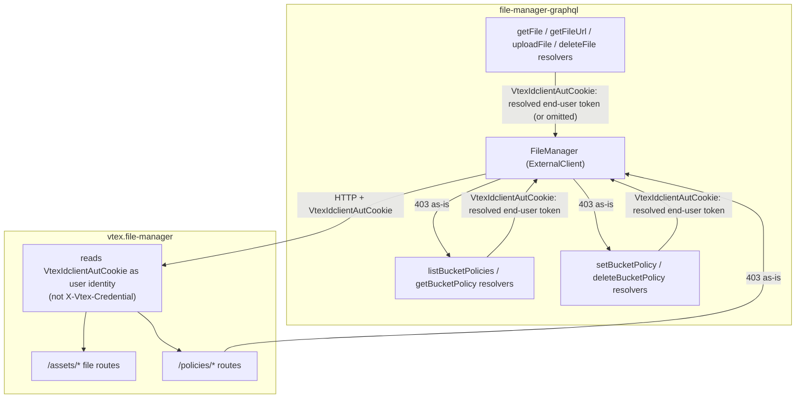
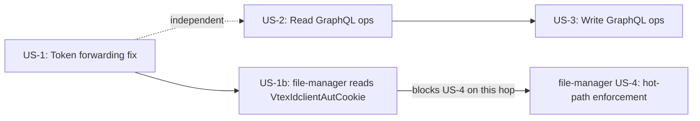

# Bucket Access Control Integration

> **Status**: Draft
> **Created**: 2026-08-07
> **Updated**: 2026-08-25
> **Epic**: STR-773
> **RFC**: Controle de Acesso a Arquivos no vtex.file-manager (Phases 4 and 9)
> **Upstream dependency**: `vtex.file-manager` — spec `bucket-access-control` (US-2, US-4)

## 1. Business Context

### Problem Statement

`vtex.file-manager` is introducing per-bucket access control (`readAccess`/`writeAccess`), enforced on every file operation based on the caller's authentication level (anonymous, authenticated, account-administrator). That enforcement can only classify a request correctly if it receives the real end user's token — but `file-manager-graphql` today forwards `context.authToken` (its own app/service token) as `VtexIdclientAutCookie` on every call to `vtex.file-manager`, for every file operation (`getFile`, `getFileUrl`, `uploadFile`, `deleteFile`). An app token does not correspond to any real user, so once file-manager activates enforcement, all traffic proxied through `file-manager-graphql` (Admin Panel, store-form) would be misclassified as anonymous and rejected in mass, regardless of who is actually making the request.

Forwarding the cookie from this app is not sufficient by itself. Today `vtex.file-manager` takes the caller token from `CredentialService.GetToken()`, which reads `X-Vtex-Credential` (`HeaderNames.Credential`). On the app-to-app hop, kube-router's `HeaderGroups.Ignored` list includes `X-Vtex-Credential` and **always remints it as the destination app's hop token** (`AddCredentialHeaders` / `AssumeRole`). `VtexIdclientAutCookie` is **not** in that ignore list, so it survives the hop — but file-manager does not read it yet. LicenseManager / US-4 classification of the end user therefore requires file-manager to **start receiving and consuming `VtexIdclientAutCookie`**.

Additionally, account administrators need a way to view and manage a bucket's access policy from the Admin Panel. `vtex.file-manager` will expose private REST APIs (`/policies/*`) for this, but the Admin Panel only talks to VTEX IO services through GraphQL — `file-manager-graphql` needs to expose the equivalent operations as a thin proxy.

This spec covers both parts owned by `file-manager-graphql` (correct token forwarding and the GraphQL surface) **and the cross-repo contract** that `vtex.file-manager` must receive and use `VtexIdclientAutCookie` as the user credential (US-1b). Implementation of that reader lives in the file-manager repo.

### Goals

- Every file operation forwarded to `vtex.file-manager` carries the real end user's token instead of the app's own token, with no exceptions and no parallel code path still using the app token.
- `vtex.file-manager` **receives and uses** that `VtexIdclientAutCookie` value as the end-user identity for LicenseManager and bucket-policy classification. It must not use `X-Vtex-Credential` / `CredentialService.GetToken()` for that purpose on this hop (kube-router remints `X-Vtex-Credential` as the app token). Implementation of the reader is in the file-manager repo; the contract is owned here (US-1b).
- Anonymous callers (no user token in context) are still correctly represented as anonymous downstream — never silently rejected because the header defaulted to an app token.
- Account administrators can list, inspect, set, and remove a bucket's admin access policy via GraphQL, as a thin proxy over file-manager's private `/policies/*` APIs, with no independent authorization logic duplicated in this app.
- `403 Forbidden` responses from file-manager (permission or immutable-bucket errors) are surfaced to the GraphQL caller as-is, not swallowed or reshaped into a generic error.

### User Stories

#### US-1: Forward the real user token on every file operation

- **Story**: As `vtex.file-manager`'s access-control enforcement, I want `file-manager-graphql` to forward the real authenticated user's token on every file operation, so that I can correctly classify each request as anonymous, authenticated, or account-administrator instead of treating all proxied traffic as anonymous.
- **Scope note**: the header (`VtexIdclientAutCookie`) already exists in the communication between the two services today — no new header is introduced. Only the *source* of its value changes, in a single place (`FileManager` client constructor), which is shared by every file operation (`getFile`, `getFileUrl`, `uploadFile`, `deleteFile`). This story is a **blocking dependency** of `vtex.file-manager`'s US-4, but it unblocks that rollout **only together with US-1b** (file-manager actually reading the cookie). This story does not itself change any authorization behavior in this app.
- **Token resolution note**: `@vtex/api`'s `IOContext` has no single `userAuthToken` field. It exposes two distinct end-user tokens — `adminUserAuthToken` (cookie `VtexIdclientAutCookie`, Admin Panel login) and `storeUserAuthToken` (cookie `VtexIdclientAutCookie_{account}`, storefront login) — populated by the `authTokens` middleware from two different VTEX ID login contexts, not by a naming inconsistency. Since this app serves both Admin Panel operations (bucket policy mutations) and store-form uploads, the correct source must resolve across both, plus the raw-header fallback already implemented in `authFromCookie` (`node/directives/auth.ts`) for callers that send the token as a bare header instead of a cookie. The token-forwarding fix must reuse that existing three-way resolution, not introduce a second, divergent one.
- **Acceptance Criteria**:
  - **Given** an authenticated user uploads a file via `store-form`/Admin Panel, **when** `file-manager-graphql` forwards the request to `vtex.file-manager`, **then** the `VtexIdclientAutCookie` header carries the resolved end-user token (`adminUserAuthToken`, `storeUserAuthToken`, or the raw `vtexidclientautcookie` header, in that order of precedence), not `context.authToken`.
  - **Given** an anonymous caller (none of the three token sources present), **when** any file mutation or query is called, **then** the `VtexIdclientAutCookie` header is omitted from the call to file-manager (file-manager already treats a missing credential as anonymous).
  - **Given** any file operation (`getFile`, `getFileUrl`, `uploadFile`, `deleteFile`), **when** it is forwarded to file-manager, **then** the same token-forwarding rule is applied uniformly — there is no operation still using `context.authToken`.
  - **Given** an account whose allow list (`config/allowList.ts`) exempts `uploadFile` from the login requirement, **when** an anonymous upload happens for that account, **then** the token-forwarding change does not alter that existing allow-list exemption — it only changes which token is forwarded when one is present.

#### US-1b: `vtex.file-manager` must receive and consume `VtexIdclientAutCookie`

- **Story**: As `file-manager-graphql`'s access-control hop, I want `vtex.file-manager` to read the `VtexIdclientAutCookie` this app already sends, so that LicenseManager and bucket-policy enforcement classify the **end user** instead of the reminted app hop token.
- **Scope note**: this story is implemented in the `vtex.file-manager` repository. It is specified here because this hop is the contract this app relies on, and because file-manager does not consume that header today (`CredentialService.GetToken()` reads only `X-Vtex-Credential`). The cookie is sent as an HTTP **header** on this hop (this app already sets it); file-manager does not need to parse the browser `Cookie` header. Manifest calls from builder-hub stay on the **service/vendor** identity path and are unchanged by this story.
- **Acceptance Criteria**:
  - **Given** an inbound HTTP request to `vtex.file-manager` that includes `VtexIdclientAutCookie` with a VTEX ID **user** token (as this app sends after US-1)
  - **When** file-manager classifies the caller for LicenseManager or bucket-policy enforcement (US-4)
  - **Then** it uses the `VtexIdclientAutCookie` value as the end-user identity
  - **Given** the same request also carries `X-Vtex-Credential` (the kube-router reminted **app** hop token)
  - **When** file-manager classifies the caller for those same checks
  - **Then** it does **not** treat `X-Vtex-Credential` / `CredentialService.GetToken()` as the end-user identity
  - **Given** an inbound request with **no** `VtexIdclientAutCookie` (anonymous caller, matching Decision 1)
  - **When** file-manager classifies the caller
  - **Then** the caller is anonymous, even if `X-Vtex-Credential` is present

#### US-2: Read bucket policies via GraphQL

- **Story**: As an account administrator using the Admin Panel, I want to list all configured bucket policies and inspect a single bucket's policy, so that I can review the current access configuration before changing it.
- **Acceptance Criteria**:
  - **Given** an admin with the `file-manager-bucket-config` resource, **when** they query `listBucketPolicies`, **then** the query proxies `GET /policies` on file-manager and returns every configured bucket with `effectivePolicy`, `manifestPolicy`, and `adminPolicy`, paginating through file-manager's `nextMarker` until every page is consumed, so the GraphQL caller receives a single complete list without needing to know about file-manager's internal pagination.
  - **Given** an admin with the `file-manager-bucket-config` resource, **when** they query `getBucketPolicy(bucket)`, **then** the query proxies `GET /policies/{bucket}` and returns `effectivePolicy`, `manifestPolicy`, and `adminPolicy` for that bucket (`null` for unconfigured sources).
  - **Given** an admin without the `file-manager-bucket-config` resource, **when** they call either query, **then** the `403 Forbidden` returned by file-manager is surfaced to the GraphQL caller as-is — `file-manager-graphql` performs no independent permission check of its own.

#### US-3: Write and remove a bucket's admin policy via GraphQL

- **Story**: As an account administrator using the Admin Panel, I want to set or remove a bucket's admin access policy, so that I can override its default or manifest-declared access levels.
- **Acceptance Criteria**:
  - **Given** an admin with the `file-manager-bucket-config` resource and an unprotected bucket, **when** they call `setBucketPolicy(bucket, readAccess, writeAccess)`, **then** the mutation proxies `POST /policies/{bucket}/admin` and returns the written `adminPolicy` with `updatedAt`/`updatedBy`.
  - **Given** an admin with the `file-manager-bucket-config` resource and an unprotected bucket, **when** they call `deleteBucketPolicy(bucket)`, **then** the mutation proxies `DELETE /policies/{bucket}/admin` and returns confirmation (`bucket`, `removedAt`).
  - **Given** one of the three protected buckets (`vtex-assets-builder`, `vtex.catalog-images-products`, `vtex.file-manager-graphql-logo`), **when** `setBucketPolicy` or `deleteBucketPolicy` is called for it, **then** the `403 Forbidden: "bucket policy is immutable"` returned by file-manager is surfaced to the caller unchanged.
  - **Given** an admin without the `file-manager-bucket-config` resource, **when** they call `setBucketPolicy` or `deleteBucketPolicy`, **then** the `403 Forbidden` from file-manager is surfaced as-is.
  - **Given** any of these mutations, **when** they are added to the schema, **then** `POST /policies/{bucket}/manifest` is **not** exposed through GraphQL at all — that route is exclusive to builder-hub's service-token flow, not the Admin Panel.

### Key Scenarios

| Scenario | Pre-conditions | Steps | Expected Result |
|---|---|---|---|
| Happy path — authenticated upload | Logged-in user, bucket with `writeAccess: authenticated` | User uploads a file via Admin Panel; `file-manager-graphql` forwards the request | `VtexIdclientAutCookie` carries the resolved end-user token; file-manager **reads that header** and accepts the upload as an authenticated request |
| Happy path — admin identity on `/policies/*` | Admin logged into Admin Panel; file-manager implements US-1b | Admin calls `setBucketPolicy`; this app sends `VtexIdclientAutCookie` | file-manager classifies the caller from that cookie; LicenseManager `file-manager-bucket-config` runs as the Admin user, not as the graphql app |
| Error — admin sets policy on a protected bucket | Admin with `file-manager-bucket-config`, bucket = `vtex-assets-builder` | Admin calls `setBucketPolicy("vtex-assets-builder", ...)` | GraphQL mutation returns the file-manager `403 Forbidden: "bucket policy is immutable"` unchanged |
| Error — file-manager still only reads `X-Vtex-Credential` | US-1 shipped; US-1b not shipped; US-4 active | Admin calls any file or `/policies/*` operation through this app | Classification uses the reminted app hop token — **must not happen** after US-1b; `AUTHENTICATED` / `ACCOUNT_ADMINISTRATOR` buckets break for Admin |
| Edge case — anonymous read with no user token | Anonymous visitor, bucket with `readAccess: public` | Visitor calls `getFile` with no session | `VtexIdclientAutCookie` header is omitted entirely; file-manager treats the request as anonymous (even if `X-Vtex-Credential` is present) and serves the public file |

### Functional Requirements

- Every call to `vtex.file-manager` for a file operation forwards the resolved end-user token (`adminUserAuthToken` → `storeUserAuthToken` → raw `vtexidclientautcookie` header, same precedence as `authFromCookie`) as `VtexIdclientAutCookie`, omitting the header when none of the three sources is present.
- `vtex.file-manager` must read `VtexIdclientAutCookie` as the end-user identity for LicenseManager / bucket-policy classification, and must not use `X-Vtex-Credential` / `CredentialService.GetToken()` for that purpose on this hop (US-1b).
- New GraphQL operations `listBucketPolicies`, `getBucketPolicy`, `setBucketPolicy`, `deleteBucketPolicy` proxy file-manager's `/policies/*` APIs (excluding `/manifest`) with no independent permission logic.
- `listBucketPolicies` transparently paginates file-manager's `nextMarker` and returns a single complete list to the GraphQL caller.
- Every `403 Forbidden` (or other error) returned by file-manager for a `/policies/*` call is surfaced to the GraphQL caller, not swallowed or replaced by a generic error.

### Non-Functional Requirements

- The token-forwarding change (US-1) must not introduce a new outbound-access policy — the destination remains `vtex.file-manager` and the header this app sends remains `VtexIdclientAutCookie`. What **does** change on the file-manager side is the credential it **reads**: it must consume that cookie (US-1b), not keep using `X-Vtex-Credential` for end-user identity.
- The new `/policies/*` proxy methods must reuse the same `ExternalClient`/`FileManager` HTTP infrastructure already used for file operations, not introduce a second client.
- `listBucketPolicies` must not perform N+1 calls — it is one or more calls to `GET /policies` (paginated), never one call per bucket.
- Unlike US-1, US-2/US-3 **do** require a new app-to-app authorization grant: `vtex.file-manager`'s current `policies.json` only scopes `file-manager-read-write` over `.../:/assets/*`, which does not cover `/policies/*`. This app's `manifest.json` must declare whatever new resource policy `vtex.file-manager` publishes for `/policies/*` (e.g. `file-manager-bucket-config-rw` or similar) — without it, `kube-router` rejects every `/policies/*` call with `403` before the request reaches file-manager's controller, regardless of the caller's LicenseManager permissions. This is a coarse app-to-app gate (which apps may call this path at all), distinct from and in addition to file-manager's own LicenseManager `file-manager-bucket-config` check (which user is authorized once the call is let through) — the router-level policy determines eligibility to call, not permission to act.

### Out of Scope

- Code changes inside the `vtex.file-manager` **repository** — those PRs live there. **In scope as a contract** (US-1b / Decision 7): file-manager must start reading `VtexIdclientAutCookie` as the user credential on this hop. Other file-manager internals stay out of scope; this spec still consumes its `/policies/*` and file APIs as documented in `vtex.file-manager`'s `bucket-access-control` spec (US-2, US-4).
- `POST /policies/{bucket}/manifest` — exclusive to builder-hub's service-token flow (see the `builder-hub` spec `file-manager-bucket-policy-integration`), never exposed via GraphQL here. That flow does **not** use the user cookie.
- Admin Panel UI/UX for bucket policy management (RFC Phase 10) — this spec only exposes the GraphQL contract it will consume.
- Activation of `vtex.file-manager`'s hot-path enforcement (US-4) in production — that activation gate depends on this spec's US-1 **and US-1b** being completed and deployed, among other cross-repo tasks, but is decided and executed by the file-manager team.
- Any change to the existing Sphinx-admin/`@requiresAuth` authorization layer used by `uploadFile`/`deleteFile` today — the new `/policies/*` operations rely exclusively on file-manager's own LicenseManager check, not on this app's Sphinx integration.

---

## 2. Arch Decisions

### Proposed Solution

Two independent, additive changes to the existing `FileManager` `ExternalClient`, plus a blocking cross-repo contract on the receiver:

1. **Token forwarding**: change the single header-construction site in `FileManager`'s constructor from `context.authToken` to the resolved end-user token (`adminUserAuthToken` → `storeUserAuthToken` → raw `vtexidclientautcookie` header — see US-1's token resolution note), with conditional inclusion (omit the header entirely when none of the three is present) instead of forwarding an `undefined`/empty value.
2. **Receiver contract (US-1b)**: `vtex.file-manager` must read `VtexIdclientAutCookie` as the end-user identity. Today's `CredentialService` / `X-Vtex-Credential` path cannot be used for that classification on this hop.
3. **Policy proxy**: add four new HTTP methods to `FileManager` (`listPolicies`, `getPolicy`, `setAdminPolicy`, `deleteAdminPolicy`), four new resolvers (`listBucketPolicies`, `getBucketPolicy`, `setBucketPolicy`, `deleteBucketPolicy`), and the corresponding GraphQL schema types/fields — following the exact same three-step pattern (schema → client method → resolver) already used for `uploadFile`/`getFile`/`deleteFile`.

### Architecture Overview



### Alternatives Considered

| Alternative | Pros | Cons | Verdict |
|---|---|---|---|
| Fall back to `context.authToken` when the end-user token is absent, instead of omitting the header | Preserves current behavior for callers that never had a user session | Reintroduces exactly the bug this spec fixes — file-manager would classify an app-token request as if it belonged to a real (anonymous-looking) user, defeating the purpose of the change | Rejected — omitting the header is the correct anonymous representation, matching file-manager's own convention |
| Use only `adminUserAuthToken` (or only `storeUserAuthToken`) as the single source, instead of resolving across both plus the raw-header fallback | Simpler, single-field read | Silently drops one of the two real login contexts this app serves (Admin Panel bucket-policy mutations use the admin cookie; store-form uploads use the store cookie or a raw header) — whichever is dropped gets misclassified as anonymous | Rejected — must reuse the existing three-way resolution already implemented in `authFromCookie` (`node/directives/auth.ts`) |
| Add `/policies/*` proxy methods to a brand-new client instead of extending `FileManager` | Clean separation of "file" vs. "policy" concerns | Duplicates HTTP/base-URL/error-handling setup already correct in `FileManager`; file-manager exposes both concerns from the same base URL and service | Rejected — no architectural boundary in file-manager itself justifies a second client here |
| Implement authorization checks for `/policies/*` inside `file-manager-graphql` (e.g. reusing Sphinx) | Faster failure without a round trip to file-manager | Duplicates a permission decision that file-manager already makes via LicenseManager; risks the two authorization sources disagreeing | Rejected — matches the RFC's explicit design: file-manager-graphql performs no independent permission logic for `/policies/*` |
| Have file-manager keep using `CredentialService.GetToken()` / `X-Vtex-Credential` as the user identity, and treat `VtexIdclientAutCookie` as optional | No file-manager code change | kube-router remints `X-Vtex-Credential` as the **app** hop token on every service-to-service call, so LicenseManager never sees the Admin/store user | Rejected — US-1b: file-manager must read `VtexIdclientAutCookie` |

### Risks & Mitigations

| Risk | Impact | Likelihood | Mitigation |
|---|---|---|---|
| US-1 ships before `vtex.file-manager`'s hot-path enforcement (US-4) is active | None — file-manager currently accepts any token value; forwarding a different (correct) token has no behavioral effect until enforcement is activated | High (expected sequencing) | Safe to deploy independently; US-1 is a prerequisite for file-manager's activation gate, not something that itself needs a feature flag |
| US-4 ships before US-1b (file-manager still only reads `CredentialService` / `X-Vtex-Credential`) | High — every caller of this app is classified as the graphql **app** (or fails the user check), so `AUTHENTICATED` / `ACCOUNT_ADMINISTRATOR` buckets break for Admin | Medium (easy to miss: the cookie is already sent today and ignored) | Blocking cross-repo gate: do not activate US-4 for this hop until file-manager reads `VtexIdclientAutCookie` (Decision 7) |
| Some existing caller path relies on `context.authToken` implicitly granting elevated access to file-manager today (since app tokens are not currently distinguished from user tokens) | Medium — if any current flow depends on the app-token side effect, that flow could start behaving differently in this app once file-manager activates enforcement | Low (file-manager's own spec does not describe today's access as differentiated by token type) | Covered by file-manager's own activation-gate risk register; this spec only ensures correct token *type* is sent, not a new business rule in this app |
| `/policies/*` proxy resolvers get out of sync with file-manager's schema (e.g. a new field added to `BucketPolicy`) | Low | Medium (two independently versioned repos) | This app declares an explicit `dependencies: { "vtex.file-manager": "0.x" }` pin (already the case); schema changes on either side go through their own spec/PR review |
| The platform's app-to-app routing (`kube-router`) silently drops `VtexIdclientAutCookie` | High — would silently defeat US-1 even after a correct implementation | Low (validated) | `VtexIdclientAutCookie` is **not** in kube-router `HeaderGroups.Ignored`; `X-Vtex-Credential` **is** and is reminted as the app token. Live hop from a linked workspace completed (`getFile` reached file-manager: 404, not 401/403). Mesh/kube-router logs do not index cookie header names — absence in logs is not evidence of a drop. See Validation Plan. |

### Validation Plan: does `VtexIdclientAutCookie` actually survive end-to-end?

Decision 1/2 assume the resolved token is **sent**. US-1b / Decision 7 assume file-manager **reads** that same header. The hop and the reader are independent.

**Step 1 — this app's own HTTP layer (verifiable in CI)**

`@vtex/api`'s `ExternalClient`/`HttpClient` merge whatever headers are passed in the client's `options.headers` into the outbound request with no allow/deny-list — the client only *adds* a fixed set of well-known headers on top (`Accept-Encoding`, `x-vtex-account`, `Authorization`, etc.); it never filters out a custom key like `VtexIdclientAutCookie`. Add a unit test for `FileManager` that intercepts the outbound HTTP call (`nock`) and asserts the request carries the literal `VtexIdclientAutCookie` header for each of the three token sources, and omits it for the anonymous case.

**Step 2 — the platform's app-to-app hop (done, 2026-08-25)**

- kube-router `HeaderGroups.Ignored` (wiki te-0029) strips/rewrites `X-Vtex-Account`, `X-Vtex-Workspace`, **`X-Vtex-Credential`**, etc. **`VtexIdclientAutCookie` is not in that list**, so the custom header is expected to survive.
- `X-Vtex-Credential` is always reminted as the destination **app** hop token (`AddCredentialHeaders` / `AssumeRole`). That is why LicenseManager **cannot** use `CredentialService.GetToken()` for end-user identity on this hop.
- Live check: `vtex link` of this app on account `storecomponents`, workspace `cookiehop825`; GraphQL `getFile` against `https://app.io.vtex.com/vtex.file-manager-graphql/v0/storecomponents/cookiehop825/_v/graphql` returned **404 File Not Found** from `FileManager.getFile` (request-id `7f84f75cbd754c8590d80645a69bd20c`). The hop reached file-manager with app auth intact (would be 401/403 if the app token hop failed). Mesh/kube-router logs do **not** index cookie header names (`raw_headers_logged` is false), so log absence of the cookie name is not evidence it was dropped.

**Step 3 — file-manager must consume the cookie (US-1b, not done)**

Repo search of `vtex.file-manager`: zero uses of `VtexIdclientAutCookie`. `CredentialService.GetToken()` reads only `HeaderNames.Credential` = `X-Vtex-Credential`. Until that reader changes, forwarding the cookie has no effect on classification. This is the remaining blocker for US-4 on this hop.

**Outcome**: Step 1 stays a permanent regression test. Step 2 is closed. Step 3 is the cross-repo work in `vtex.file-manager` (Decision 7). Do not treat US-1 as sufficient for activating file-manager US-4.

### Key Decisions

#### Decision 1: Omit the header rather than send an empty/undefined token

- **Status**: Accepted
- **Context**: The resolved end-user token (see US-1's token resolution note) may be absent for anonymous callers. `vtex.file-manager` already interprets the complete absence of `VtexIdclientAutCookie` as anonymous (per its own spec, US-4 AC on missing header).
- **Decision**: `FileManager`'s constructor only includes the `VtexIdclientAutCookie` header when the resolved token is truthy; when absent, the header key itself is omitted from the request, not sent with an empty string.
- **Consequences**: Matches file-manager's documented anonymous-detection behavior exactly; avoids ambiguity between "header present but empty" and "header absent", which file-manager's contract does not promise to treat identically.

#### Decision 2: Token source resolves across both VTEX ID login contexts, not a single field

- **Status**: Accepted
- **Context**: `@vtex/api`'s `IOContext` (v7) has no `userAuthToken` field. It exposes `adminUserAuthToken` (from cookie `VtexIdclientAutCookie`, set on Admin Panel login) and `storeUserAuthToken` (from cookie `VtexIdclientAutCookie_{account}`, set on storefront login) as two genuinely distinct tokens, populated by the `authTokens` middleware — not a naming inconsistency to resolve by picking one. This app's own `authFromCookie` (`node/directives/auth.ts`) already resolves a third source, the raw `vtexidclientautcookie` request header, for callers that send the token outside a cookie.
- **Decision**: `FileManager`'s constructor resolves the outbound token with the same precedence already used by `authFromCookie`: cookie `VtexIdclientAutCookie` (`adminUserAuthToken`) → raw `vtexidclientautcookie` header → cookie `VtexIdclientAutCookie_{account}` (`storeUserAuthToken`), so Admin Panel bucket-policy operations and store-form file operations both resolve correctly without a second, divergent implementation.
- **Consequences**: A single, shared resolution function should be extracted (or the existing `authFromCookie` logic reused directly) so `FileManager` and the `@requiresAuth` directive never disagree about who the caller is — avoiding a scenario where `@requiresAuth` authorizes a request from a raw header while `FileManager` still omits the token and file-manager classifies it as anonymous.

#### Decision 3: `/policies/*` proxy methods live on the existing `FileManager` client, not a new client

- **Status**: Accepted
- **Context**: `FileManager` already encapsulates the base URL, credential header, and `ExternalClient` plumbing for `vtex.file-manager`. There is no existing precedent in this repo for splitting one downstream service across two client classes.
- **Decision**: Add `listPolicies`, `getPolicy`, `setAdminPolicy`, `deleteAdminPolicy` as additional public methods on `FileManager`, reusing its constructor, base path, and header setup.
- **Consequences**: Keeps a single source of truth for how this app talks to file-manager; new methods automatically inherit the corrected token-forwarding behavior from Decision 1/2.

#### Decision 4: Downstream errors (including `403`) are rethrown as-is for `/policies/*`, mirroring `getFile`'s pattern

- **Status**: Accepted
- **Context**: The repo has two existing error-handling patterns: `getFile`/`getFileUrl`/`deleteFile` rethrow file-manager's error as-is (except mapping `404` to a local `FileNotFound`); `saveFile` always wraps errors into `InternalServerError`, which would obscure a `403` as a generic 500-family error.
- **Decision**: The new `/policies/*` methods follow the rethrow-as-is pattern (no `404`-style remapping needed, since file-manager's policy routes do not define a `404` semantic for this flow) — a file-manager `403` propagates to the GraphQL layer with its original status and message intact.
- **Consequences**: Admin Panel receives the exact reason for a rejection (e.g. `"bucket policy is immutable"`) instead of a generic failure; avoids reusing the `saveFile`-style wrapper, which was designed for upload-specific failure semantics, not permission decisions.

#### Decision 5: No new `@requiresAuth`/Sphinx layer for `/policies/*` operations

- **Status**: Accepted
- **Context**: `deleteFile` today additionally requires Sphinx admin, on top of `@requiresAuth`. The RFC and file-manager's own spec assign `/policies/*` authorization exclusively to LicenseManager's `file-manager-bucket-config` resource, checked with the forwarded `VtexIdclientAutCookie` (Decision 8/9 of file-manager's spec).
- **Decision**: `listBucketPolicies`, `getBucketPolicy`, `setBucketPolicy`, `deleteBucketPolicy` resolvers apply `@requiresAuth` (so an anonymous caller is rejected at the GraphQL layer before even reaching file-manager) but do **not** add a Sphinx admin check — the account-administrator decision belongs entirely to file-manager's LicenseManager check.
- **Consequences**: Avoids a second, possibly inconsistent, authorization source; `@requiresAuth` here is purely a "must be logged in" gate, not an "is admin" gate — file-manager's `403` is the actual admin-permission signal.

#### Decision 6: A new resource policy declaration is a hard prerequisite for `/policies/*`, separate from LicenseManager authorization

- **Status**: Accepted
- **Context**: `vtex.file-manager`'s current `policies.json` declares `file-manager-read-write` scoped only to `vrn:vtex.file-manager:{{region}}:{{account}}:{{workspace}}:/assets/*`. This is a VTEX IO **router-level, app-to-app** authorization grant — enforced by `kube-router` before a request ever reaches file-manager's controller — and it is a different mechanism from file-manager's own LicenseManager check on `file-manager-bucket-config` (which authorizes the *end user*, once the call has already been let through by the router). The existing scope does not cover `/policies/*`, so as designed today every `/policies/*` call from this app would be rejected with `403` at the router, regardless of the caller's LicenseManager permissions.
- **Decision**: This app's `manifest.json` must declare whatever new resource policy `vtex.file-manager` publishes for `/policies/*` once it exists (tracked as a cross-repo sequencing dependency, not something this app can pre-declare against a name that doesn't exist yet — see Implementation Plan).
- **Consequences**: US-2/US-3 cannot be deployed (even for internal testing against a real file-manager instance) until file-manager ships and publishes the new resource policy. This is a hard, blocking cross-repo dependency distinct from, and in addition to, the existing LicenseManager-based authorization already documented in Decision 5.

#### Decision 7: User identity on this hop is `VtexIdclientAutCookie`, not `X-Vtex-Credential`

- **Status**: Accepted
- **Context**: This app already sends `VtexIdclientAutCookie` on every `FileManager` call. `vtex.file-manager` today authenticates via `CredentialService.GetToken()`, which reads `X-Vtex-Credential`. kube-router's `HeaderGroups.Ignored` includes `X-Vtex-Credential` and remints it as the destination **app** hop token (`AddCredentialHeaders` / `AssumeRole`). `VtexIdclientAutCookie` is not in that ignore list and survives the hop (Validation Plan Step 2). Using `CredentialService` for LicenseManager / US-4 would therefore classify every caller of this app as the graphql app, never as the Admin or store user.
- **Decision**: For end-user classification (LicenseManager `file-manager-bucket-config`, bucket-policy enforcement US-4) on requests that originate from this app, `vtex.file-manager` **must read `VtexIdclientAutCookie`**. It must **not** use `X-Vtex-Credential` / `CredentialService.GetToken()` as the end-user identity. Absence of `VtexIdclientAutCookie` means anonymous, even when `X-Vtex-Credential` is present. Implementation is in the file-manager repo (US-1b); this spec owns the hop contract. Builder-hub manifest calls remain on the service/vendor identity path and do not use this cookie.
- **Consequences**: US-1 in this app is necessary but not sufficient for US-4. Activating hot-path enforcement before US-1b ships breaks Admin `AUTHENTICATED` / `ACCOUNT_ADMINISTRATOR` access through this proxy. File-manager's own `bucket-access-control` spec must be updated to match this decision.

### Implementation Plan



1. **US-1** — change the header source in `FileManager`'s constructor to the resolved end-user token (Decision 2); add/adjust unit tests covering each of the three sources and the fully-anonymous case. Deployable independently and immediately, with no dependency on file-manager's own rollout status.
2. **US-1b (blocks file-manager US-4 on this hop)** — `vtex.file-manager` must read `VtexIdclientAutCookie` as the user credential (Decision 7). Tracked in the file-manager repo; this app cannot substitute `X-Vtex-Credential` for that identity. Do not activate US-4 for traffic from this app until this ships.
3. **Cross-repo prerequisite (blocks US-2/US-3)** — `vtex.file-manager` must publish a new resource policy covering `/policies/*` (Decision 6). This app's `manifest.json` must declare it before any `/policies/*` call can reach file-manager's controller in a real environment — track as an explicit dependency, sequenced before end-to-end testing of US-2/US-3 (implementation and unit tests with mocks can proceed in parallel).
4. **US-2** — add `listPolicies`/`getPolicy` methods to `FileManager`, the corresponding schema types (`BucketPolicy`, `BucketPolicyView`) and `Query` fields, and resolvers. Requires `vtex.file-manager`'s US-2 (`/policies/*` APIs) already deployed, and the resource policy from step 3 already declared, to be tested end-to-end (can still be implemented and unit-tested with mocks beforehand).
5. **US-3** — add `setAdminPolicy`/`deleteAdminPolicy` methods, `Mutation` fields, and resolvers, reusing US-2's types.

---

## 3. Technical Contract

### Data Models

GraphQL schema additions (`graphql/schema.graphql`):

```graphql
enum AccessLevel {
  PUBLIC
  AUTHENTICATED
  ACCOUNT_ADMINISTRATOR
}

type BucketPolicy {
  readAccess: AccessLevel!
  writeAccess: AccessLevel!
  updatedAt: String
  updatedBy: String
}

type BucketPolicyView {
  bucket: String!
  effectivePolicy: BucketPolicy!
  manifestPolicy: BucketPolicy
  adminPolicy: BucketPolicy
}

extend type Query {
  listBucketPolicies: [BucketPolicyView!]! @requiresAuth
  getBucketPolicy(bucket: String!): BucketPolicyView @requiresAuth
}

extend type Mutation {
  setBucketPolicy(bucket: String!, readAccess: AccessLevel!, writeAccess: AccessLevel!): BucketPolicy @requiresAuth
  deleteBucketPolicy(bucket: String!): Boolean! @requiresAuth
}
```

### Interfaces

New `FileManager` client methods (`node/FileManager.ts`), alongside the existing `getFile`/`getFileUrl`/`saveFile`/`deleteFile`:

```
listPolicies(marker?: string): Promise<{ policies: BucketPolicyView[]; nextMarker: string | null }>
  → GET /policies?marker={marker}

getPolicy(bucket: string): Promise<BucketPolicyView | null>
  → GET /policies/{bucket}

setAdminPolicy(bucket: string, readAccess: AccessLevel, writeAccess: AccessLevel): Promise<BucketPolicy>
  → POST /policies/{bucket}/admin, body { readAccess, writeAccess }

deleteAdminPolicy(bucket: string): Promise<{ bucket: string; removedAt: string }>
  → DELETE /policies/{bucket}/admin
```

Updated constructor (`node/FileManager.ts`), replacing the current hardcoded `context.authToken` with the resolved end-user token (Decision 2, same precedence as `authFromCookie` in `node/directives/auth.ts`):

```
const resolvedUserToken =
  context.adminUserAuthToken ??
  rawVtexIdClientAutCookieHeader ??  // read the same way authFromCookie does, from the raw request header
  context.storeUserAuthToken

headers: {
  ...(options?.headers ?? {}),
  ...(resolvedUserToken ? { VtexIdclientAutCookie: resolvedUserToken } : {}),
  'Content-Type': 'application/json',
  'X-Vtex-Use-Https': 'true',
}
```

Resolvers (`node/resolvers/index.ts`), following the existing pattern:

```
listBucketPolicies: async (_: unknown, __: unknown, ctx: ServiceContext) => {
  const fileManager = new FileManager(ctx.vtex)
  // paginate via nextMarker until exhausted, concatenating `policies`
}

getBucketPolicy: async (_: unknown, args: { bucket: string }, ctx: ServiceContext) => {
  const fileManager = new FileManager(ctx.vtex)
  return fileManager.getPolicy(args.bucket)
}

setBucketPolicy: async (_: unknown, args: SetBucketPolicyArgs, ctx: ServiceContext) => {
  const fileManager = new FileManager(ctx.vtex)
  return fileManager.setAdminPolicy(args.bucket, args.readAccess, args.writeAccess)
}

deleteBucketPolicy: async (_: unknown, args: { bucket: string }, ctx: ServiceContext) => {
  const fileManager = new FileManager(ctx.vtex)
  await fileManager.deleteAdminPolicy(args.bucket)
  return true
}
```

### Integration Points

- **`vtex.file-manager`** (existing dependency, `dependencies: { "vtex.file-manager": "0.x" }` in `manifest.json`): all four file operations plus the four new `/policies/*` operations, over the existing `ExternalClient` base URL. User identity on this hop is the HTTP header `VtexIdclientAutCookie` (Decision 7 / US-1b) — file-manager must consume it; `X-Vtex-Credential` is the reminted app hop token and is not the end-user. The four `/policies/*` operations additionally require this app's `manifest.json` to declare a new resource policy that `vtex.file-manager` must publish first (Decision 6) — the existing `file-manager-read-write` policy does not cover `/policies/*`.
- **Admin Panel** (consumer, out of scope): will call `listBucketPolicies`, `getBucketPolicy`, `setBucketPolicy`, `deleteBucketPolicy` through this app's GraphQL schema — this spec only guarantees the contract exists and behaves as documented above.

### Invariants & Constraints

- `VtexIdclientAutCookie` is never populated from `context.authToken` for any file or policy operation after this spec is implemented.
- On this hop, `vtex.file-manager` classifies the end user from `VtexIdclientAutCookie`, never from `X-Vtex-Credential` / `CredentialService.GetToken()`. Missing `VtexIdclientAutCookie` is anonymous even when `X-Vtex-Credential` is present.
- `POST /policies/{bucket}/manifest` is never reachable through this app's GraphQL schema.
- Every `403`/error returned by `vtex.file-manager` for a `/policies/*` call reaches the GraphQL caller with its original message and status, never replaced by a generic `InternalServerError`.
- `listBucketPolicies` always returns a fully paginated, deduplicated list — it never silently returns only the first page.
- `/policies/*` operations cannot function at all — regardless of LicenseManager permissions — until this app's `manifest.json` declares the new resource policy `vtex.file-manager` publishes for that path (Decision 6).
