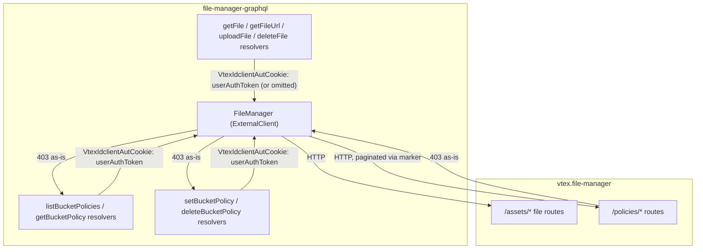
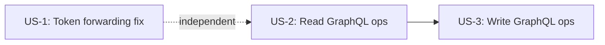

# Bucket Access Control Integration

> **Status**: Draft
> **Created**: 2026-08-07
> **Epic**: STR-773
> **RFC**: Controle de Acesso a Arquivos no vtex.file-manager (Phases 4 and 9)
> **Upstream dependency**: `vtex.file-manager` — spec `bucket-access-control` (US-2, US-4)

## 1. Business Context

### Problem Statement

`vtex.file-manager` is introducing per-bucket access control (`readAccess`/`writeAccess`), enforced on every file operation based on the caller's authentication level (anonymous, authenticated, account-administrator). That enforcement can only classify a request correctly if it receives the real end user's token — but `file-manager-graphql` today forwards `context.authToken` (its own app/service token) as `VtexIdclientAutCookie` on every call to `vtex.file-manager`, for every file operation (`getFile`, `getFileUrl`, `uploadFile`, `deleteFile`). An app token does not correspond to any real user, so once file-manager activates enforcement, all traffic proxied through `file-manager-graphql` (Admin Panel, store-form) would be misclassified as anonymous and rejected in mass, regardless of who is actually making the request.

Additionally, account administrators need a way to view and manage a bucket's access policy from the Admin Panel. `vtex.file-manager` will expose private REST APIs (`/policies/*`) for this, but the Admin Panel only talks to VTEX IO services through GraphQL — `file-manager-graphql` needs to expose the equivalent operations as a thin proxy.

This spec covers both parts, exclusively owned by `file-manager-graphql`, of the cross-repo rollout: correct token forwarding (a blocking prerequisite for file-manager's enforcement) and the GraphQL surface for bucket policy management (consumed by the Admin Panel, out of this spec's scope).

### Goals

- Every file operation forwarded to `vtex.file-manager` carries the real end user's token (`userAuthToken`) instead of the app's own token, with no exceptions and no parallel code path still using the app token.
- Anonymous callers (no user token in context) are still correctly represented as anonymous downstream — never silently rejected because the header defaulted to an app token.
- Account administrators can list, inspect, set, and remove a bucket's admin access policy via GraphQL, as a thin proxy over file-manager's private `/policies/*` APIs, with no independent authorization logic duplicated in this app.
- `403 Forbidden` responses from file-manager (permission or immutable-bucket errors) are surfaced to the GraphQL caller as-is, not swallowed or reshaped into a generic error.

### User Stories

#### US-1: Forward the real user token on every file operation

- **Story**: As `vtex.file-manager`'s access-control enforcement, I want `file-manager-graphql` to forward the real authenticated user's token on every file operation, so that I can correctly classify each request as anonymous, authenticated, or account-administrator instead of treating all proxied traffic as anonymous.
- **Scope note**: the header (`VtexIdclientAutCookie`) already exists in the communication between the two services today — no new header is introduced. Only the *source* of its value changes, in a single place (`FileManager` client constructor), which is shared by every file operation (`getFile`, `getFileUrl`, `uploadFile`, `deleteFile`).
- **Acceptance Criteria**:
  - **Given** an authenticated user uploads a file via `store-form`/Admin Panel, **when** `file-manager-graphql` forwards the request to `vtex.file-manager`, **then** the `VtexIdclientAutCookie` header carries `context.userAuthToken`, not `context.authToken`.
  - **Given** an anonymous caller (no user token present in `ctx.vtex`), **when** any file mutation or query is called, **then** the `VtexIdclientAutCookie` header is omitted from the call to file-manager (file-manager already treats a missing credential as anonymous).
  - **Given** any file operation (`getFile`, `getFileUrl`, `uploadFile`, `deleteFile`), **when** it is forwarded to file-manager, **then** the same token-forwarding rule is applied uniformly — there is no operation still using `context.authToken`.
  - **Given** an account whose allow list (`config/allowList.ts`) exempts `uploadFile` from the login requirement, **when** an anonymous upload happens for that account, **then** the token-forwarding change does not alter that existing allow-list exemption — it only changes which token is forwarded when one is present.

#### US-2: Read bucket policies via GraphQL

- **Story**: As an account administrator using the Admin Panel, I want to list all configured bucket policies and inspect a single bucket's policy, so that I can review the current access configuration before changing it.
- **Acceptance Criteria**:
  - **Given** an admin with the `file-manager-bucket-config` resource, **when** they query `listBucketPolicies`, **then** the query proxies `GET /policies` on file-manager and returns every configured bucket with `effectivePolicy`, `manifestPolicy`, and `adminPolicy`, paginating through file-manager's `nextMarker` until every page is consumed, so the GraphQL caller receives a single complete list without needing to know about file-manager's internal pagination.
  - **Given** an admin with the `file-manager-bucket-config` resource, **when** they query `getBucketPolicy(bucket)`, **then** the query proxies `GET /policies/{bucket}` and returns `effectivePolicy`, `manifestPolicy`, and `adminPolicy` for that bucket (`null` for unconfigured sources).
  - **Given** an admin without the `file-manager-bucket-config` resource, **when** they call either query, **then** the `403 Forbidden` returned by file-manager is surfaced to the GraphQL caller as-is — `file-manager-graphql` performs no independent permission check of its own.

#### US-3: Write and remove a bucket's admin policy via GraphQL

- **Story**: As an account administrator using the Admin Panel, I want to set or remove a bucket's admin access policy, so that I can override its default or manifest-declared access levels.
- **Acceptance Criteria**:
  - **Given** an admin with the `file-manager-bucket-config` resource and an unprotected bucket, **when** they call `setBucketPolicy(bucket, readAccess, writeAccess)`, **then** the mutation proxies `POST /policies/{bucket}/admin` and returns the written `adminPolicy` with `updatedAt`/`updatedBy`.
  - **Given** an admin with the `file-manager-bucket-config` resource and an unprotected bucket, **when** they call `deleteBucketPolicy(bucket)`, **then** the mutation proxies `DELETE /policies/{bucket}/admin` and returns confirmation (`bucket`, `removedAt`).
  - **Given** one of the three protected buckets (`vtex-assets-builder`, `vtex.catalog-images-products`, `vtex.file-manager-graphql-logo`), **when** `setBucketPolicy` or `deleteBucketPolicy` is called for it, **then** the `403 Forbidden: "bucket policy is immutable"` returned by file-manager is surfaced to the caller unchanged.
  - **Given** an admin without the `file-manager-bucket-config` resource, **when** they call `setBucketPolicy` or `deleteBucketPolicy`, **then** the `403 Forbidden` from file-manager is surfaced as-is.
  - **Given** any of these mutations, **when** they are added to the schema, **then** `POST /policies/{bucket}/manifest` is **not** exposed through GraphQL at all — that route is exclusive to builder-hub's service-token flow, not the Admin Panel.

### Key Scenarios

| Scenario | Pre-conditions | Steps | Expected Result |
|---|---|---|---|
| Happy path — authenticated upload | Logged-in user, bucket with `writeAccess: authenticated` | User uploads a file via Admin Panel; `file-manager-graphql` forwards the request | `VtexIdclientAutCookie` carries `userAuthToken`; file-manager accepts the upload as an authenticated request |
| Error — admin sets policy on a protected bucket | Admin with `file-manager-bucket-config`, bucket = `vtex-assets-builder` | Admin calls `setBucketPolicy("vtex-assets-builder", ...)` | GraphQL mutation returns the file-manager `403 Forbidden: "bucket policy is immutable"` unchanged |
| Edge case — anonymous read with no user token | Anonymous visitor, bucket with `readAccess: public` | Visitor calls `getFile` with no session | `VtexIdclientAutCookie` header is omitted entirely; file-manager treats the request as anonymous and serves the public file |

### Functional Requirements

- Every call to `vtex.file-manager` for a file operation forwards `context.userAuthToken` as `VtexIdclientAutCookie`, omitting the header when no user token is present.
- New GraphQL operations `listBucketPolicies`, `getBucketPolicy`, `setBucketPolicy`, `deleteBucketPolicy` proxy file-manager's `/policies/*` APIs (excluding `/manifest`) with no independent permission logic.
- `listBucketPolicies` transparently paginates file-manager's `nextMarker` and returns a single complete list to the GraphQL caller.
- Every `403 Forbidden` (or other error) returned by file-manager for a `/policies/*` call is surfaced to the GraphQL caller, not swallowed or replaced by a generic error.

### Non-Functional Requirements

- The token-forwarding change (US-1) must not introduce a new outbound-access policy — the header target (`vtex.file-manager`) and its credential mechanism are unchanged; only the token value's source changes.
- The new `/policies/*` proxy methods must reuse the same `ExternalClient`/`FileManager` HTTP infrastructure already used for file operations, not introduce a second client.
- `listBucketPolicies` must not perform N+1 calls — it is one or more calls to `GET /policies` (paginated), never one call per bucket.

### Out of Scope

- Any change inside `vtex.file-manager` itself — this spec only consumes its existing/planned `/policies/*` and file APIs, documented in `vtex.file-manager`'s `bucket-access-control` spec (US-2, US-4).
- `POST /policies/{bucket}/manifest` — exclusive to builder-hub's service-token flow (see the `builder-hub` spec `file-manager-bucket-policy-integration`), never exposed via GraphQL here.
- Admin Panel UI/UX for bucket policy management (RFC Phase 10) — this spec only exposes the GraphQL contract it will consume.
- Activation of `vtex.file-manager`'s hot-path enforcement (US-4) in production — that activation gate depends on this spec's US-1 being completed and deployed, among other cross-repo tasks, but is decided and executed by the file-manager team.
- Any change to the existing Sphinx-admin/`@requiresAuth` authorization layer used by `uploadFile`/`deleteFile` today — the new `/policies/*` operations rely exclusively on file-manager's own LicenseManager check, not on this app's Sphinx integration.

---

## 2. Arch Decisions

### Proposed Solution

Two independent, additive changes to the existing `FileManager` `ExternalClient`:

1. **Token forwarding**: change the single header-construction site in `FileManager`'s constructor from `context.authToken` to `context.userAuthToken`, with conditional inclusion (omit the header entirely when the token is absent) instead of forwarding an `undefined`/empty value.
2. **Policy proxy**: add four new HTTP methods to `FileManager` (`listPolicies`, `getPolicy`, `setAdminPolicy`, `deleteAdminPolicy`), four new resolvers (`listBucketPolicies`, `getBucketPolicy`, `setBucketPolicy`, `deleteBucketPolicy`), and the corresponding GraphQL schema types/fields — following the exact same three-step pattern (schema → client method → resolver) already used for `uploadFile`/`getFile`/`deleteFile`.

### Architecture Overview



### Alternatives Considered

| Alternative | Pros | Cons | Verdict |
|---|---|---|---|
| Fall back to `context.authToken` when `userAuthToken` is absent, instead of omitting the header | Preserves current behavior for callers that never had a user session | Reintroduces exactly the bug this spec fixes — file-manager would classify an app-token request as if it belonged to a real (anonymous-looking) user, defeating the purpose of the change | Rejected — omitting the header is the correct anonymous representation, matching file-manager's own convention |
| Add `/policies/*` proxy methods to a brand-new client instead of extending `FileManager` | Clean separation of "file" vs. "policy" concerns | Duplicates HTTP/base-URL/error-handling setup already correct in `FileManager`; file-manager exposes both concerns from the same base URL and service | Rejected — no architectural boundary in file-manager itself justifies a second client here |
| Implement authorization checks for `/policies/*` inside `file-manager-graphql` (e.g. reusing Sphinx) | Faster failure without a round trip to file-manager | Duplicates a permission decision that file-manager already makes via LicenseManager; risks the two authorization sources disagreeing | Rejected — matches the RFC's explicit design: file-manager-graphql performs no independent permission logic for `/policies/*` |

### Risks & Mitigations

| Risk | Impact | Likelihood | Mitigation |
|---|---|---|---|
| US-1 ships before `vtex.file-manager`'s hot-path enforcement (US-4) is active | None — file-manager currently accepts any token value; forwarding a different (correct) token has no behavioral effect until enforcement is activated | High (expected sequencing) | Safe to deploy independently; US-1 is a prerequisite for file-manager's activation gate, not something that itself needs a feature flag |
| Some existing caller path relies on `context.authToken` implicitly granting elevated access to file-manager today (since app tokens are not currently distinguished from user tokens) | Medium — if any current flow depends on the app-token side effect, that flow could start behaving differently in this app once file-manager activates enforcement | Low (file-manager's own spec does not describe today's access as differentiated by token type) | Covered by file-manager's own activation-gate risk register; this spec only ensures correct token *type* is sent, not a new business rule in this app |
| `/policies/*` proxy resolvers get out of sync with file-manager's schema (e.g. a new field added to `BucketPolicy`) | Low | Medium (two independently versioned repos) | This app declares an explicit `dependencies: { "vtex.file-manager": "0.x" }` pin (already the case); schema changes on either side go through their own spec/PR review |

### Key Decisions

#### Decision 1: Omit the header rather than send an empty/undefined token

- **Status**: Accepted
- **Context**: `context.userAuthToken` may be `undefined` for anonymous callers. `vtex.file-manager` already interprets the complete absence of `VtexIdclientAutCookie` as anonymous (per its own spec, US-4 AC on missing header).
- **Decision**: `FileManager`'s constructor only includes the `VtexIdclientAutCookie` header when `context.userAuthToken` is truthy; when absent, the header key itself is omitted from the request, not sent with an empty string.
- **Consequences**: Matches file-manager's documented anonymous-detection behavior exactly; avoids ambiguity between "header present but empty" and "header absent", which file-manager's contract does not promise to treat identically.

#### Decision 2: `/policies/*` proxy methods live on the existing `FileManager` client, not a new client

- **Status**: Accepted
- **Context**: `FileManager` already encapsulates the base URL, credential header, and `ExternalClient` plumbing for `vtex.file-manager`. There is no existing precedent in this repo for splitting one downstream service across two client classes.
- **Decision**: Add `listPolicies`, `getPolicy`, `setAdminPolicy`, `deleteAdminPolicy` as additional public methods on `FileManager`, reusing its constructor, base path, and header setup.
- **Consequences**: Keeps a single source of truth for how this app talks to file-manager; new methods automatically inherit the corrected token-forwarding behavior from Decision 1.

#### Decision 3: Downstream errors (including `403`) are rethrown as-is for `/policies/*`, mirroring `getFile`'s pattern

- **Status**: Accepted
- **Context**: The repo has two existing error-handling patterns: `getFile`/`getFileUrl`/`deleteFile` rethrow file-manager's error as-is (except mapping `404` to a local `FileNotFound`); `saveFile` always wraps errors into `InternalServerError`, which would obscure a `403` as a generic 500-family error.
- **Decision**: The new `/policies/*` methods follow the rethrow-as-is pattern (no `404`-style remapping needed, since file-manager's policy routes do not define a `404` semantic for this flow) — a file-manager `403` propagates to the GraphQL layer with its original status and message intact.
- **Consequences**: Admin Panel receives the exact reason for a rejection (e.g. `"bucket policy is immutable"`) instead of a generic failure; avoids reusing the `saveFile`-style wrapper, which was designed for upload-specific failure semantics, not permission decisions.

#### Decision 4: No new `@requiresAuth`/Sphinx layer for `/policies/*` operations

- **Status**: Accepted
- **Context**: `deleteFile` today additionally requires Sphinx admin, on top of `@requiresAuth`. The RFC and file-manager's own spec assign `/policies/*` authorization exclusively to LicenseManager's `file-manager-bucket-config` resource, checked with the forwarded `VtexIdclientAutCookie` (Decision 8/9 of file-manager's spec).
- **Decision**: `listBucketPolicies`, `getBucketPolicy`, `setBucketPolicy`, `deleteBucketPolicy` resolvers apply `@requiresAuth` (so an anonymous caller is rejected at the GraphQL layer before even reaching file-manager) but do **not** add a Sphinx admin check — the account-administrator decision belongs entirely to file-manager's LicenseManager check.
- **Consequences**: Avoids a second, possibly inconsistent, authorization source; `@requiresAuth` here is purely a "must be logged in" gate, not an "is admin" gate — file-manager's `403` is the actual admin-permission signal.

### Implementation Plan



1. **US-1** — change the header source in `FileManager`'s constructor; add/adjust unit tests covering the presence and absence of `userAuthToken`. Deployable independently and immediately, with no dependency on file-manager's own rollout status.
2. **US-2** — add `listPolicies`/`getPolicy` methods to `FileManager`, the corresponding schema types (`BucketPolicy`, `BucketPolicyView`) and `Query` fields, and resolvers. Requires `vtex.file-manager`'s US-2 (`/policies/*` APIs) already deployed to be tested end-to-end (can still be implemented and unit-tested with mocks beforehand).
3. **US-3** — add `setAdminPolicy`/`deleteAdminPolicy` methods, `Mutation` fields, and resolvers, reusing US-2's types.

---

## 3. Technical Contract

### Data Models

GraphQL schema additions (`graphql/schema.graphql`):

```graphql
enum AccessLevel {
  PUBLIC
  AUTHENTICATED
  ACCOUNT_ADMINISTRATOR
}

type BucketPolicy {
  readAccess: AccessLevel!
  writeAccess: AccessLevel!
  updatedAt: String
  updatedBy: String
}

type BucketPolicyView {
  bucket: String!
  effectivePolicy: BucketPolicy!
  manifestPolicy: BucketPolicy
  adminPolicy: BucketPolicy
}

extend type Query {
  listBucketPolicies: [BucketPolicyView!]! @requiresAuth
  getBucketPolicy(bucket: String!): BucketPolicyView @requiresAuth
}

extend type Mutation {
  setBucketPolicy(bucket: String!, readAccess: AccessLevel!, writeAccess: AccessLevel!): BucketPolicy @requiresAuth
  deleteBucketPolicy(bucket: String!): Boolean! @requiresAuth
}
```

### Interfaces

New `FileManager` client methods (`node/FileManager.ts`), alongside the existing `getFile`/`getFileUrl`/`saveFile`/`deleteFile`:

```
listPolicies(marker?: string): Promise<{ policies: BucketPolicyView[]; nextMarker: string | null }>
  → GET /policies?marker={marker}

getPolicy(bucket: string): Promise<BucketPolicyView | null>
  → GET /policies/{bucket}

setAdminPolicy(bucket: string, readAccess: AccessLevel, writeAccess: AccessLevel): Promise<BucketPolicy>
  → POST /policies/{bucket}/admin, body { readAccess, writeAccess }

deleteAdminPolicy(bucket: string): Promise<{ bucket: string; removedAt: string }>
  → DELETE /policies/{bucket}/admin
```

Updated constructor (`node/FileManager.ts`), replacing the current hardcoded `context.authToken`:

```
headers: {
  ...(options?.headers ?? {}),
  ...(context.userAuthToken ? { VtexIdclientAutCookie: context.userAuthToken } : {}),
  'Content-Type': 'application/json',
  'X-Vtex-Use-Https': 'true',
}
```

Resolvers (`node/resolvers/index.ts`), following the existing pattern:

```
listBucketPolicies: async (_: unknown, __: unknown, ctx: ServiceContext) => {
  const fileManager = new FileManager(ctx.vtex)
  // paginate via nextMarker until exhausted, concatenating `policies`
}

getBucketPolicy: async (_: unknown, args: { bucket: string }, ctx: ServiceContext) => {
  const fileManager = new FileManager(ctx.vtex)
  return fileManager.getPolicy(args.bucket)
}

setBucketPolicy: async (_: unknown, args: SetBucketPolicyArgs, ctx: ServiceContext) => {
  const fileManager = new FileManager(ctx.vtex)
  return fileManager.setAdminPolicy(args.bucket, args.readAccess, args.writeAccess)
}

deleteBucketPolicy: async (_: unknown, args: { bucket: string }, ctx: ServiceContext) => {
  const fileManager = new FileManager(ctx.vtex)
  await fileManager.deleteAdminPolicy(args.bucket)
  return true
}
```

### Integration Points

- **`vtex.file-manager`** (existing dependency, `dependencies: { "vtex.file-manager": "0.x" }` in `manifest.json`): all four file operations plus the four new `/policies/*` operations, over the existing `ExternalClient` base URL.
- **Admin Panel** (consumer, out of scope): will call `listBucketPolicies`, `getBucketPolicy`, `setBucketPolicy`, `deleteBucketPolicy` through this app's GraphQL schema — this spec only guarantees the contract exists and behaves as documented above.

### Invariants & Constraints

- `VtexIdclientAutCookie` is never populated from `context.authToken` for any file or policy operation after this spec is implemented.
- `POST /policies/{bucket}/manifest` is never reachable through this app's GraphQL schema.
- Every `403`/error returned by `vtex.file-manager` for a `/policies/*` call reaches the GraphQL caller with its original message and status, never replaced by a generic `InternalServerError`.
- `listBucketPolicies` always returns a fully paginated, deduplicated list — it never silently returns only the first page.
