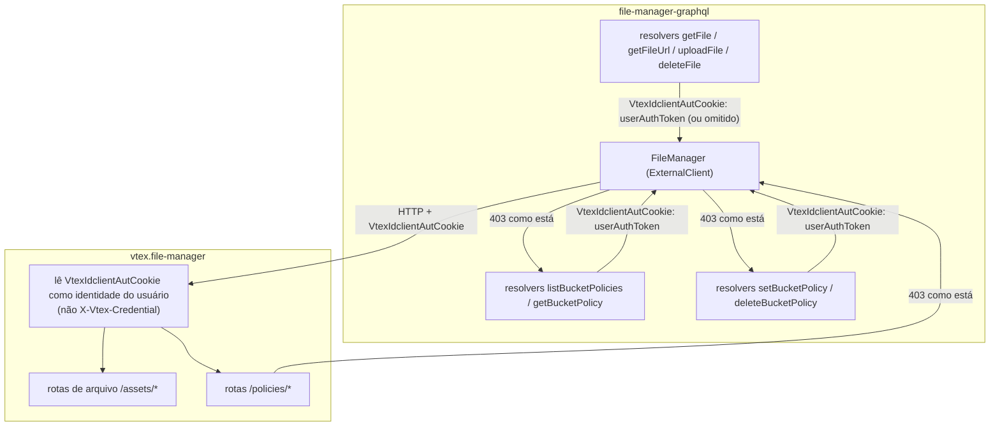
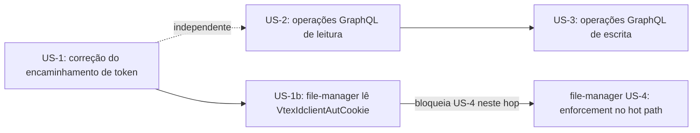

# Integração com Controle de Acesso a Buckets

> **Status**: Approved
> **Criado em**: 2026-08-07
> **Atualizado em**: 2026-08-26
> **Épico**: STR-773
> **RFC**: Controle de Acesso a Arquivos no vtex.file-manager (Fases 4 e 9)
> **Dependência upstream**: `vtex.file-manager` — spec `bucket-access-control` (US-2, US-4)
> **Nota de tradução**: esta é a tradução literal, 100% em português, de [`bucket-access-control-integration.md`](./bucket-access-control-integration.md) (fonte de verdade em inglês). Identificadores de código, rotas, nomes de campos e nomes de classe permanecem no original.

## 1. Contexto de Negócio

### Declaração do Problema

O `vtex.file-manager` está introduzindo controle de acesso granular por bucket (`readAccess`/`writeAccess`), aplicado em toda operação de arquivo com base no nível de autenticação de quem chama (anônimo, autenticado, account-administrator). Esse enforcement só consegue classificar uma requisição corretamente se receber o token real do usuário final — mas hoje o `file-manager-graphql` encaminha `context.authToken` (o token da própria app/serviço) como `VtexIdclientAutCookie` em toda chamada ao `vtex.file-manager`, para toda operação de arquivo (`getFile`, `getFileUrl`, `uploadFile`, `deleteFile`). Um token de app não corresponde a nenhum usuário real, então, quando o file-manager ativar o enforcement, todo o tráfego proxied pelo `file-manager-graphql` (Admin Panel, store-form) seria classificado como anônimo e rejeitado em massa, independentemente de quem realmente esteja fazendo a requisição.

Só encaminhar o cookie nesta app não basta. Hoje o `vtex.file-manager` pega o token de quem chama em `CredentialService.GetToken()`, que lê `X-Vtex-Credential` (`HeaderNames.Credential`). No hop app-a-app, a lista `HeaderGroups.Ignored` do kube-router inclui `X-Vtex-Credential` e **sempre o reminta como o hop token da app de destino** (`AddCredentialHeaders` / `AssumeRole`). `VtexIdclientAutCookie` **não** está nessa lista, então sobrevive ao hop — mas o file-manager ainda não o lê. A classificação do usuário final no LicenseManager / US-4 portanto exige que o file-manager **passe a receber e consumir `VtexIdclientAutCookie`**.

Além disso, administradores de conta precisam de uma forma de visualizar e gerenciar a política de acesso de um bucket a partir do Admin Panel. O `vtex.file-manager` vai expor APIs REST privadas (`/policies/*`) para isso, mas o Admin Panel só se comunica com serviços da VTEX IO via GraphQL — o `file-manager-graphql` precisa expor as operações equivalentes como um proxy fino.

Esta spec cobre as duas partes de responsabilidade do `file-manager-graphql` (encaminhamento correto de token e a superfície GraphQL) **e o contrato cross-repo** de que o `vtex.file-manager` deve receber e usar `VtexIdclientAutCookie` como credencial do usuário (US-1b). A implementação desse reader fica no repositório do file-manager.

### Objetivos

- Toda operação de arquivo encaminhada ao `vtex.file-manager` carrega o token real do usuário final (`userAuthToken`) em vez do token da própria app, sem exceções e sem nenhum caminho de código paralelo ainda usando o token de app.
- O `vtex.file-manager` **recebe e usa** o valor de `VtexIdclientAutCookie` como identidade do usuário final para LicenseManager e classificação de política de bucket. Não deve usar `X-Vtex-Credential` / `CredentialService.GetToken()` para esse fim neste hop (o kube-router reminta `X-Vtex-Credential` como token da app). A implementação do reader é no repositório do file-manager; o contrato é desta spec (US-1b).
- Callers anônimos (sem token de usuário no contexto) continuam sendo corretamente representados como anônimos no downstream — nunca rejeitados silenciosamente porque o header assumiu por padrão um token de app.
- Administradores de conta conseguem listar, inspecionar, definir e remover a política de acesso admin de um bucket via GraphQL, como um proxy fino sobre as APIs privadas `/policies/*` do file-manager, sem nenhuma lógica de autorização independente duplicada nesta app.
- Respostas `403 Forbidden` do file-manager (erros de permissão ou de bucket imutável) são expostas ao caller GraphQL como estão, sem serem engolidas ou reformatadas em um erro genérico.

### User Stories

#### US-1: Encaminhar o token real do usuário em toda operação de arquivo

- **História**: Como o enforcement de controle de acesso do `vtex.file-manager`, eu quero que o `file-manager-graphql` encaminhe o token real do usuário autenticado em toda operação de arquivo, para que eu consiga classificar corretamente cada requisição como anônima, autenticada ou account-administrator, em vez de tratar todo o tráfego proxied como anônimo.
- **Nota de escopo**: o header (`VtexIdclientAutCookie`) já existe hoje na comunicação entre os dois serviços — nenhum header novo é introduzido. Apenas a *origem* do seu valor muda, em um único lugar (constructor do client `FileManager`), compartilhado por toda operação de arquivo (`getFile`, `getFileUrl`, `uploadFile`, `deleteFile`). Esta história é dependência bloqueante da US-4 do `vtex.file-manager`, mas só desbloqueia esse rollout **junto com a US-1b** (o file-manager de fato ler o cookie). Esta história não muda nenhum comportamento de autorização nesta app.
- **Critérios de Aceite**:
  - **Given** um usuário autenticado faz upload de um arquivo via `store-form`/Admin Panel, **when** o `file-manager-graphql` encaminha a requisição ao `vtex.file-manager`, **then** o header `VtexIdclientAutCookie` carrega `context.userAuthToken`, não `context.authToken`.
  - **Given** um caller anônimo (sem token de usuário presente em `ctx.vtex`), **when** qualquer mutation ou query de arquivo é chamada, **then** o header `VtexIdclientAutCookie` é omitido da chamada ao file-manager (o file-manager já trata a ausência de credencial como anônimo).
  - **Given** qualquer operação de arquivo (`getFile`, `getFileUrl`, `uploadFile`, `deleteFile`), **when** ela é encaminhada ao file-manager, **then** a mesma regra de encaminhamento de token é aplicada uniformemente — não existe operação ainda usando `context.authToken`.
  - **Given** uma conta cuja allow list (`config/allowList.ts`) isenta `uploadFile` da exigência de login, **when** um upload anônimo acontece para essa conta, **then** a mudança de encaminhamento de token não altera essa isenção existente da allow list — ela só muda qual token é encaminhado quando um está presente.

#### US-1b: o `vtex.file-manager` deve receber e consumir `VtexIdclientAutCookie`

- **História**: Como o hop de controle de acesso do `file-manager-graphql`, eu quero que o `vtex.file-manager` leia o `VtexIdclientAutCookie` que esta app já envia, para que o LicenseManager e o enforcement de política de bucket classifiquem o **usuário final**, e não o hop token de app remintado.
- **Nota de escopo**: esta história é implementada no repositório do `vtex.file-manager`. Está especificada aqui porque este hop é o contrato do qual esta app depende, e porque o file-manager hoje não consome esse header (`CredentialService.GetToken()` lê só `X-Vtex-Credential`). O cookie é enviado como **header HTTP** neste hop (esta app já o define); o file-manager não precisa parsear o header `Cookie` do browser. Chamadas de manifest do builder-hub continuam no caminho de identidade **serviço/vendor** e não mudam com esta história.
- **Critérios de Aceite**:
  - **Given** uma requisição HTTP inbound ao `vtex.file-manager` que inclui `VtexIdclientAutCookie` com um token VTEX ID de **usuário** (como esta app envia após a US-1)
  - **When** o file-manager classifica quem chama para LicenseManager ou enforcement de política de bucket (US-4)
  - **Then** ele usa o valor de `VtexIdclientAutCookie` como identidade do usuário final
  - **Given** a mesma requisição também carrega `X-Vtex-Credential` (o hop token de **app** remintado pelo kube-router)
  - **When** o file-manager classifica quem chama para as mesmas checagens
  - **Then** ele **não** trata `X-Vtex-Credential` / `CredentialService.GetToken()` como identidade do usuário final
  - **Given** uma requisição inbound **sem** `VtexIdclientAutCookie` (caller anônimo, alinhado à Decisão 1)
  - **When** o file-manager classifica quem chama
  - **Then** o caller é anônimo, mesmo que `X-Vtex-Credential` esteja presente

#### US-2: Ler políticas de bucket via GraphQL

- **História**: Como um administrador de conta usando o Admin Panel, eu quero listar todas as políticas de bucket configuradas e inspecionar a política de um único bucket, para que eu possa revisar a configuração de acesso atual antes de alterá-la.
- **Critérios de Aceite**:
  - **Given** um admin com o resource `file-manager-bucket-config`, **when** ele consulta `listBucketPolicies`, **then** a query faz proxy de `GET /policies` no file-manager e retorna todo bucket configurado com `effectivePolicy`, `manifestPolicy` e `adminPolicy`, paginando através do `nextMarker` do file-manager até consumir todas as páginas, de forma que o caller GraphQL receba uma lista única e completa sem precisar conhecer a paginação interna do file-manager.
  - **Given** um admin com o resource `file-manager-bucket-config`, **when** ele consulta `getBucketPolicy(bucket)`, **then** a query faz proxy de `GET /policies/{bucket}` e retorna `effectivePolicy`, `manifestPolicy` e `adminPolicy` para esse bucket (`null` para fontes não configuradas).
  - **Given** um admin sem o resource `file-manager-bucket-config`, **when** ele chama qualquer uma das duas queries, **then** o `403 Forbidden` retornado pelo file-manager é exposto ao caller GraphQL como está — o `file-manager-graphql` não realiza nenhuma checagem de permissão independente.

#### US-3: Escrever e remover a política admin de um bucket via GraphQL

- **História**: Como um administrador de conta usando o Admin Panel, eu quero definir ou remover a política de acesso admin de um bucket, para que eu possa sobrescrever seus níveis de acesso padrão ou declarados via manifest.
- **Critérios de Aceite**:
  - **Given** um admin com o resource `file-manager-bucket-config` e um bucket não protegido, **when** ele chama `setBucketPolicy(bucket, readAccess, writeAccess)`, **then** a mutation faz proxy de `POST /policies/{bucket}/admin` e retorna a `adminPolicy` gravada com `updatedAt`/`updatedBy`.
  - **Given** um admin com o resource `file-manager-bucket-config` e um bucket não protegido, **when** ele chama `deleteBucketPolicy(bucket)`, **then** a mutation faz proxy de `DELETE /policies/{bucket}/admin` e retorna a confirmação (`bucket`, `removedAt`).
  - **Given** um dos três buckets protegidos (`vtex-assets-builder`, `vtex.catalog-images-products`, `vtex.file-manager-graphql-logo`), **when** `setBucketPolicy` ou `deleteBucketPolicy` é chamado para ele, **then** o `403 Forbidden: "bucket policy is immutable"` retornado pelo file-manager é exposto ao caller sem alteração.
  - **Given** um admin sem o resource `file-manager-bucket-config`, **when** ele chama `setBucketPolicy` ou `deleteBucketPolicy`, **then** o `403 Forbidden` do file-manager é exposto como está.
  - **Given** essas mutations, **when** forem adicionadas ao schema, **then** `POST /policies/{bucket}/manifest` **não** é exposta via GraphQL de forma alguma — essa rota é exclusiva do fluxo de token de serviço do builder-hub, não do Admin Panel.

### Cenários Principais

| Cenário | Pré-condições | Passos | Resultado Esperado |
|---|---|---|---|
| Caminho feliz — upload autenticado | Usuário logado, bucket com `writeAccess: authenticated` | Usuário faz upload de arquivo via Admin Panel; `file-manager-graphql` encaminha a requisição | `VtexIdclientAutCookie` carrega `userAuthToken`; o file-manager **lê esse header** e aceita o upload como requisição autenticada |
| Caminho feliz — identidade admin em `/policies/*` | Admin logado no Admin Panel; file-manager implementa US-1b | Admin chama `setBucketPolicy`; esta app envia `VtexIdclientAutCookie` | o file-manager classifica quem chama a partir desse cookie; o LicenseManager `file-manager-bucket-config` roda como o usuário Admin, não como a app graphql |
| Erro — admin define política em bucket protegido | Admin com `file-manager-bucket-config`, bucket = `vtex-assets-builder` | Admin chama `setBucketPolicy("vtex-assets-builder", ...)` | A mutation GraphQL retorna o `403 Forbidden: "bucket policy is immutable"` do file-manager sem alteração |
| Erro — file-manager ainda só lê `X-Vtex-Credential` | US-1 entregue; US-1b não entregue; US-4 ativa | Admin chama qualquer operação de arquivo ou `/policies/*` por esta app | A classificação usa o hop token de app remintado — **não pode acontecer** após a US-1b; buckets `AUTHENTICATED` / `ACCOUNT_ADMINISTRATOR` quebram para o Admin |
| Edge case — leitura anônima sem token de usuário | Visitante anônimo, bucket com `readAccess: public` | Visitante chama `getFile` sem sessão | O header `VtexIdclientAutCookie` é totalmente omitido; o file-manager trata a requisição como anônima (mesmo com `X-Vtex-Credential` presente) e serve o arquivo público |

### Requisitos Funcionais

- Toda chamada ao `vtex.file-manager` para uma operação de arquivo encaminha `context.userAuthToken` como `VtexIdclientAutCookie`, omitindo o header quando não há token de usuário presente.
- O `vtex.file-manager` deve ler `VtexIdclientAutCookie` como identidade do usuário final para classificação no LicenseManager / política de bucket, e não deve usar `X-Vtex-Credential` / `CredentialService.GetToken()` para esse fim neste hop (US-1b).
- Novas operações GraphQL `listBucketPolicies`, `getBucketPolicy`, `setBucketPolicy`, `deleteBucketPolicy` fazem proxy das APIs `/policies/*` do file-manager (exceto `/manifest`), sem lógica de permissão independente.
- `listBucketPolicies` pagina de forma transparente o `nextMarker` do file-manager e retorna uma lista única e completa ao caller GraphQL.
- Todo `403 Forbidden` (ou outro erro) retornado pelo file-manager para uma chamada `/policies/*` é exposto ao caller GraphQL, não engolido nem substituído por um erro genérico.

### Requisitos Não Funcionais

- A mudança de encaminhamento de token (US-1) não deve introduzir uma nova policy de outbound-access — o destino continua `vtex.file-manager` e o header que esta app envia continua `VtexIdclientAutCookie`. O que **muda** no lado do file-manager é a credencial que ele **lê**: deve consumir esse cookie (US-1b), e não continuar usando `X-Vtex-Credential` como identidade do usuário final.
- Os novos métodos de proxy `/policies/*` devem reaproveitar a mesma infraestrutura HTTP `ExternalClient`/`FileManager` já usada para operações de arquivo, sem introduzir um segundo client.
- `listBucketPolicies` não deve fazer chamadas N+1 — é uma ou mais chamadas a `GET /policies` (paginadas), nunca uma chamada por bucket.
- Diferente da US-1, as US-2/US-3 **exigem** uma nova concessão de autorização app-a-app: o `policies.json` atual do `vtex.file-manager` escopa apenas `file-manager-read-write` sobre `.../:/assets/*`, o que não cobre `/policies/*`. O `manifest.json` desta app declara a política de recurso `file-manager-bucket-config-rw` publicada pelo `vtex.file-manager` (ver Decisão 6) — sem ela, o `kube-router` rejeita toda chamada `/policies/*` com `403` antes de a requisição chegar ao controller do file-manager, independentemente das permissões do LicenseManager do caller. Esse é um gate grosso app-a-app (quais apps podem chamar esse path), distinto e adicional à checagem do LicenseManager `file-manager-bucket-config` do próprio file-manager (quem está autorizado a agir, uma vez que a chamada é liberada) — a política em nível de router determina elegibilidade para chamar, não permissão para agir.
- **NFR-O11y**: logging estruturado (sem PII) em toda operação `/policies/*` (`listBucketPolicies`, `getBucketPolicy`, `setBucketPolicy`, `deleteBucketPolicy`), incluindo o `bucket` alvo e o resultado (`200`/`403`/outro status) reportado pelo `vtex.file-manager`; nenhuma nova span de tracing é necessária além do que o `ExternalClient` já emite para chamadas HTTP de saída.

### Fora de Escopo

- Mudanças de código no **repositório** do `vtex.file-manager` — esses PRs vivem lá. **No escopo como contrato** (US-1b / Decisão 7): o file-manager deve passar a ler `VtexIdclientAutCookie` como credencial de usuário neste hop. Outros internos do file-manager continuam fora de escopo; esta spec ainda consome suas APIs `/policies/*` e de arquivo, documentadas na spec `bucket-access-control` do `vtex.file-manager` (US-2, US-4).
- `POST /policies/{bucket}/manifest` — exclusiva do fluxo de token de serviço do builder-hub (ver a spec `file-manager-bucket-policy-integration` do `builder-hub`), nunca exposta via GraphQL aqui. Esse fluxo **não** usa o cookie de usuário.
- UI/UX do Admin Panel para gestão de política de bucket (Fase 10 da RFC) — esta spec apenas expõe o contrato GraphQL que ela vai consumir.
- Ativação em produção do enforcement no hot path do `vtex.file-manager` (US-4) — esse gate de ativação depende da US-1 **e da US-1b** desta spec estarem concluídas e deployadas, entre outras tarefas cross-repo, mas é decidido e executado pelo time do file-manager.
- Qualquer mudança na camada de autorização Sphinx-admin/`@requiresAuth` já existente, usada hoje por `uploadFile`/`deleteFile` — as novas operações `/policies/*` dependem exclusivamente da própria checagem via LicenseManager do file-manager, não da integração Sphinx desta app.

---

## 2. Decisões de Arquitetura

### Solução Proposta

Duas mudanças independentes e aditivas ao `ExternalClient` `FileManager` já existente, mais um contrato cross-repo bloqueante no receptor:

1. **Encaminhamento de token**: mudar o único ponto de construção do header no constructor do `FileManager`, de `context.authToken` para `context.userAuthToken`, com inclusão condicional (omitir o header inteiramente quando o token estiver ausente, em vez de encaminhar um valor `undefined`/vazio).
2. **Contrato do receptor (US-1b)**: o `vtex.file-manager` deve ler `VtexIdclientAutCookie` como identidade do usuário final. O caminho atual `CredentialService` / `X-Vtex-Credential` não pode ser usado para essa classificação neste hop.
3. **Proxy de política**: adicionar quatro novos métodos HTTP ao `FileManager` (`listPolicies`, `getPolicy`, `setAdminPolicy`, `deleteAdminPolicy`), quatro novos resolvers (`listBucketPolicies`, `getBucketPolicy`, `setBucketPolicy`, `deleteBucketPolicy`) e os tipos/campos correspondentes no schema GraphQL — seguindo exatamente o mesmo padrão de três passos (schema → método do client → resolver) já usado para `uploadFile`/`getFile`/`deleteFile`.

### Visão Geral da Arquitetura



### Alternativas Consideradas

| Alternativa | Vantagens | Desvantagens | Veredito |
|---|---|---|---|
| Fazer fallback para `context.authToken` quando `userAuthToken` estiver ausente, em vez de omitir o header | Preserva o comportamento atual para callers que nunca tiveram uma sessão de usuário | Reintroduz exatamente o bug que esta spec corrige — o file-manager classificaria uma requisição com token de app como se pertencesse a um usuário real (aparentemente anônimo), anulando o propósito da mudança | Rejeitada — omitir o header é a representação correta de anônimo, alinhada com a própria convenção do file-manager |
| Adicionar os métodos de proxy `/policies/*` em um client novo, em vez de estender o `FileManager` | Separação limpa entre as preocupações de "arquivo" e "política" | Duplica a configuração de HTTP/base-URL/tratamento de erro já correta no `FileManager`; o próprio file-manager expõe as duas preocupações a partir da mesma base URL e serviço | Rejeitada — nenhuma fronteira arquitetural no próprio file-manager justifica um segundo client aqui |
| Implementar checagens de autorização para `/policies/*` dentro do `file-manager-graphql` (ex.: reaproveitando o Sphinx) | Falha mais rápida, sem uma ida e volta ao file-manager | Duplica uma decisão de permissão que o file-manager já toma via LicenseManager; risco de as duas fontes de autorização divergirem | Rejeitada — alinhada com o desenho explícito da RFC: o file-manager-graphql não realiza nenhuma lógica de permissão independente para `/policies/*` |
| O file-manager continuar usando `CredentialService.GetToken()` / `X-Vtex-Credential` como identidade do usuário, e tratar `VtexIdclientAutCookie` como opcional | Sem mudança de código no file-manager | O kube-router reminta `X-Vtex-Credential` como hop token da **app** em toda chamada serviço-a-serviço, então o LicenseManager nunca vê o usuário Admin/store | Rejeitada — US-1b: o file-manager deve ler `VtexIdclientAutCookie` |

### Riscos e Mitigações

| Risco | Impacto | Probabilidade | Mitigação |
|---|---|---|---|
| A US-1 é lançada antes do enforcement no hot path (US-4) do `vtex.file-manager` estar ativo | Nenhum — o file-manager hoje aceita qualquer valor de token; encaminhar um token diferente (correto) não tem efeito comportamental até o enforcement ser ativado | Alta (sequenciamento esperado) | Seguro deployar de forma independente; a US-1 é pré-requisito para a ativação do file-manager, não algo que em si precise de feature flag |
| A US-4 é lançada antes da US-1b (file-manager ainda só lê `CredentialService` / `X-Vtex-Credential`) | Alto — todo caller desta app é classificado como a **app** graphql (ou falha a checagem de usuário), então buckets `AUTHENTICATED` / `ACCOUNT_ADMINISTRATOR` quebram para o Admin | Média (fácil de passar: o cookie já é enviado hoje e ignorado) | Gate cross-repo bloqueante: não ativar a US-4 neste hop até o file-manager ler `VtexIdclientAutCookie` (Decisão 7) |
| Algum fluxo existente de caller depende implicitamente de `context.authToken` conceder acesso elevado ao file-manager hoje (já que tokens de app não são hoje diferenciados de tokens de usuário) | Médio — se algum fluxo atual depender desse efeito colateral do token de app, esse fluxo pode passar a se comportar diferente nesta app quando o file-manager ativar o enforcement | Baixa (a própria spec do file-manager não descreve o acesso de hoje como diferenciado por tipo de token) | Coberto pelo próprio registro de risco do gate de ativação do file-manager; esta spec só garante que o *tipo* correto de token seja enviado, não uma nova regra de negócio nesta app |
| Os resolvers de proxy `/policies/*` ficam fora de sincronia com o schema do file-manager (ex.: um campo novo adicionado a `BucketPolicy`) | Baixo | Média (dois repositórios versionados de forma independente) | Esta app já declara um pin explícito em `dependencies: { "vtex.file-manager": "0.x" }` (já é o caso hoje); mudanças de schema em qualquer um dos lados passam por sua própria revisão de spec/PR |
| O roteamento app-a-app da plataforma (`kube-router`) descarta silenciosamente `VtexIdclientAutCookie` | Alto — derrotaria a US-1 mesmo após uma implementação correta | Baixa (validado) | `VtexIdclientAutCookie` **não** está em `HeaderGroups.Ignored` do kube-router; `X-Vtex-Credential` **está** e é remintado como token da app. Hop ao vivo a partir de um workspace linkado completou (`getFile` chegou ao file-manager: 404, não 401/403). Logs de mesh/kube-router não indexam nomes de header de cookie — ausência nos logs não é evidência de drop. Ver Plano de Validação. |

### Plano de Validação: o `VtexIdclientAutCookie` sobrevive de ponta a ponta?

As Decisões 1/2 assumem que o token resolvido é **enviado**. A US-1b / Decisão 7 assume que o file-manager **lê** esse mesmo header. O hop e o reader são independentes.

**Passo 1 — a camada HTTP desta app (verificável em CI)**

O `ExternalClient`/`HttpClient` do `@vtex/api` mescla os headers passados em `options.headers` na requisição de saída sem allow/deny-list — o client só *adiciona* um conjunto fixo de headers conhecidos (`Accept-Encoding`, `x-vtex-account`, `Authorization`, etc.); nunca filtra uma chave custom como `VtexIdclientAutCookie`. Adicionar um teste unitário do `FileManager` que intercepta a chamada HTTP de saída (`nock`) e afirma que a requisição carrega o header literal `VtexIdclientAutCookie` para cada fonte de token, e o omite no caso anônimo.

**Passo 2 — o hop app-a-app da plataforma (feito, 2026-08-25)**

- `HeaderGroups.Ignored` do kube-router (wiki te-0029) stripa/reescreve `X-Vtex-Account`, `X-Vtex-Workspace`, **`X-Vtex-Credential`**, etc. **`VtexIdclientAutCookie` não está nessa lista**, então o header custom é esperado sobreviver.
- `X-Vtex-Credential` é sempre remintado como hop token da **app** de destino (`AddCredentialHeaders` / `AssumeRole`). Por isso o LicenseManager **não pode** usar `CredentialService.GetToken()` como identidade do usuário final neste hop.
- Checagem ao vivo: `vtex link` desta app na conta `storecomponents`, workspace `cookiehop825`; GraphQL `getFile` contra `https://app.io.vtex.com/vtex.file-manager-graphql/v0/storecomponents/cookiehop825/_v/graphql` retornou **404 File Not Found** de `FileManager.getFile` (request-id `7f84f75cbd754c8590d80645a69bd20c`). O hop chegou ao file-manager com auth de app intacta (seria 401/403 se o hop token da app falhasse). Logs de mesh/kube-router **não** indexam nomes de header de cookie (`raw_headers_logged` é false), então a ausência do nome do cookie nos logs não é evidência de drop.

**Passo 3 — o file-manager deve consumir o cookie (US-1b, não feito)**

Busca no repositório do `vtex.file-manager`: zero usos de `VtexIdclientAutCookie`. `CredentialService.GetToken()` lê só `HeaderNames.Credential` = `X-Vtex-Credential`. Até esse reader mudar, encaminhar o cookie não tem efeito na classificação. Este é o blocker restante da US-4 neste hop.

**Resultado**: o Passo 1 permanece como teste de regressão permanente. O Passo 2 está fechado. O Passo 3 é o trabalho cross-repo no `vtex.file-manager` (Decisão 7). Não tratar a US-1 como suficiente para ativar a US-4 do file-manager.

### Decisões-Chave

#### Decisão 1: Omitir o header em vez de enviar um token vazio/undefined

- **Status**: Aceita
- **Contexto**: `context.userAuthToken` pode ser `undefined` para callers anônimos. O `vtex.file-manager` já interpreta a ausência completa de `VtexIdclientAutCookie` como anônimo (conforme sua própria spec, critério de aceite da US-4 sobre header ausente).
- **Decisão**: O constructor do `FileManager` só inclui o header `VtexIdclientAutCookie` quando `context.userAuthToken` é truthy; quando ausente, a própria chave do header é omitida da requisição, não enviada com uma string vazia.
- **Consequências**: Alinha-se exatamente com o comportamento de detecção de anônimo documentado pelo file-manager; evita ambiguidade entre "header presente mas vazio" e "header ausente", que o contrato do file-manager não promete tratar de forma idêntica.

#### Decisão 2: a fonte do token resolve os dois contextos de login VTEX ID, não um único campo

- **Status**: Aceita
- **Contexto**: o `IOContext` do `@vtex/api` (v7) não tem um campo `userAuthToken` único. Ele expõe `adminUserAuthToken` (do cookie `VtexIdclientAutCookie`, definido no login do Admin Panel) e `storeUserAuthToken` (do cookie `VtexIdclientAutCookie_{account}`, definido no login da vitrine) como dois tokens genuinamente distintos, populados pelo middleware `authTokens` — não uma inconsistência de nomenclatura a resolver escolhendo um. O próprio `authFromCookie` desta app (`node/directives/auth.ts`) já resolve uma terceira fonte, o header raw `vtexidclientautcookie`, para callers que enviam o token fora de um cookie.
- **Decisão**: o constructor do `FileManager` resolve o token de saída com a mesma precedência já usada por `authFromCookie`: cookie `VtexIdclientAutCookie` (`adminUserAuthToken`) → header raw `vtexidclientautcookie` → cookie `VtexIdclientAutCookie_{account}` (`storeUserAuthToken`), de forma que operações do Admin Panel sobre política de bucket e operações de arquivo do store-form sejam ambas resolvidas corretamente, sem uma segunda implementação divergente.
- **Consequências**: uma função de resolução única e compartilhada deve ser extraída (ou a lógica existente de `authFromCookie` reaproveitada diretamente), para que `FileManager` e a directive `@requiresAuth` nunca discordem sobre quem é o caller — evitando um cenário em que `@requiresAuth` autoriza uma requisição a partir de um header raw enquanto `FileManager` ainda omite o token e o file-manager classifica como anônimo.

#### Decisão 3: Os métodos de proxy `/policies/*` vivem no client `FileManager` existente, não em um client novo

- **Status**: Aceita
- **Contexto**: O `FileManager` já encapsula a base URL, o header de credencial e a infraestrutura de `ExternalClient` para o `vtex.file-manager`. Não existe precedente neste repositório para dividir um serviço downstream em duas classes de client.
- **Decisão**: Adicionar `listPolicies`, `getPolicy`, `setAdminPolicy`, `deleteAdminPolicy` como métodos públicos adicionais no `FileManager`, reaproveitando seu constructor, path base e configuração de header.
- **Consequências**: Mantém uma única fonte de verdade sobre como esta app se comunica com o file-manager; os novos métodos herdam automaticamente o comportamento corrigido de encaminhamento de token das Decisões 1 e 2.

#### Decisão 4: Erros do downstream (incluindo `403`) são relançados como estão para `/policies/*`, no mesmo padrão de `getFile`

- **Status**: Aceita
- **Contexto**: O repositório tem dois padrões existentes de tratamento de erro: `getFile`/`getFileUrl`/`deleteFile` relançam o erro do file-manager como está (exceto o mapeamento de `404` para um `FileNotFound` local); `saveFile` sempre encapsula erros em `InternalServerError`, o que obscureceria um `403` como um erro genérico da família 500.
- **Decisão**: Os novos métodos `/policies/*` seguem o padrão de relançar como está (nenhum remapeamento estilo `404` é necessário, já que as rotas de política do file-manager não definem uma semântica de `404` para este fluxo) — um `403` do file-manager se propaga até a camada GraphQL com seu status e mensagem originais intactos.
- **Consequências**: O Admin Panel recebe o motivo exato de uma rejeição (ex.: `"bucket policy is immutable"`) em vez de uma falha genérica; evita reaproveitar o wrapper estilo `saveFile`, que foi desenhado para semânticas de falha específicas de upload, não para decisões de permissão.

#### Decisão 5: Sem camada nova de `@requiresAuth`/Sphinx para as operações `/policies/*`

- **Status**: Aceita
- **Contexto**: `deleteFile` hoje exige adicionalmente admin do Sphinx, além de `@requiresAuth`. A RFC e a própria spec do file-manager atribuem a autorização de `/policies/*` exclusivamente ao resource `file-manager-bucket-config` do LicenseManager, checado com o `VtexIdclientAutCookie` encaminhado (Decision 8/9 da spec do file-manager).
- **Decisão**: Os resolvers `listBucketPolicies`, `getBucketPolicy`, `setBucketPolicy`, `deleteBucketPolicy` aplicam `@requiresAuth` (para que um caller anônimo seja rejeitado na camada GraphQL antes mesmo de chegar ao file-manager), mas **não** adicionam uma checagem de admin do Sphinx — a decisão de account-administrator pertence inteiramente à checagem do LicenseManager do file-manager.
- **Consequências**: Evita uma segunda fonte de autorização, possivelmente inconsistente; `@requiresAuth` aqui é puramente um gate de "precisa estar logado", não de "é admin" — o `403` do file-manager é o sinal real de permissão de admin.

#### Decisão 6: uma nova declaração de política de recurso é pré-requisito obrigatório para `/policies/*`, separada da autorização do LicenseManager

- **Status**: Aceita
- **Contexto**: o `policies.json` atual do `vtex.file-manager` declara `file-manager-read-write`, escopado apenas a `vrn:vtex.file-manager:{{region}}:{{account}}:{{workspace}}:/assets/*`. Essa é uma concessão de autorização app-a-app, em nível de router VTEX IO — aplicada pelo `kube-router` antes de a requisição chegar ao controller do file-manager — e é um mecanismo diferente da própria checagem do LicenseManager do file-manager sobre `file-manager-bucket-config` (que autoriza o *usuário final*, uma vez que a chamada já foi liberada pelo router). O escopo existente não cobre `/policies/*`, então, como desenhado hoje, toda chamada `/policies/*` desta app seria rejeitada com `403` no router, independentemente das permissões do LicenseManager do caller.
- **Decisão**: o `manifest.json` desta app declara a política de recurso que o `vtex.file-manager` publica: `file-manager-bucket-config-rw`, escopada por VRN a `vrn:vtex.file-manager:{{region}}:{{account}}:{{workspace}}:/policies/*` (resource confirmado e publicado, `resourceKey: file-manager-bucket-config`, categoria `Infrastructure`). **Nomeie isso de forma concreta já na spec** — uma versão anterior desta decisão deixava o nome exato como "o que o file-manager publicar, quando existir"; essa ambiguidade foi exatamente o que abriu espaço para a rota em si sofrer drift durante a implementação (uma renomeação de rota foi tentada como workaround para uma colisão de nome de bucket não relacionada, e depois revertida — ver a própria spec do file-manager, regra de colisão de router da US-1). Especificar o VRN/nome do resource de forma concreta desde o início remove a tentação de alterar o path da rota em vez de corrigir a colisão de nome real.
- **Consequências**: US-2/US-3 exigem tanto (a) o `policies.json` do file-manager publicando `file-manager-bucket-config-rw` quanto (b) o `manifest.json` desta app declarando-o, antes que qualquer chamada `/policies/*` alcance o controller do file-manager. É uma dependência cross-repo obrigatória e bloqueante, distinta e adicional à autorização já baseada em LicenseManager documentada na Decisão 5.

#### Decisão 7: identidade do usuário neste hop é `VtexIdclientAutCookie`, não `X-Vtex-Credential`

- **Status**: Aceita
- **Contexto**: Esta app já envia `VtexIdclientAutCookie` em toda chamada do `FileManager`. O `vtex.file-manager` hoje autentica via `CredentialService.GetToken()`, que lê `X-Vtex-Credential`. O `HeaderGroups.Ignored` do kube-router inclui `X-Vtex-Credential` e o reminta como hop token da **app** de destino (`AddCredentialHeaders` / `AssumeRole`). `VtexIdclientAutCookie` não está nessa lista e sobrevive ao hop (Plano de Validação, Passo 2). Usar `CredentialService` para LicenseManager / US-4 classificaria todo caller desta app como a app graphql, nunca como o usuário Admin ou store.
- **Decisão**: Para classificação do usuário final (LicenseManager `file-manager-bucket-config`, enforcement de política de bucket US-4) em requisições originadas desta app, o `vtex.file-manager` **deve ler `VtexIdclientAutCookie`**. **Não** deve usar `X-Vtex-Credential` / `CredentialService.GetToken()` como identidade do usuário final. Ausência de `VtexIdclientAutCookie` significa anônimo, mesmo quando `X-Vtex-Credential` está presente. A implementação é no repositório do file-manager (US-1b); esta spec é dona do contrato do hop. Chamadas de manifest do builder-hub continuam no caminho de identidade serviço/vendor e não usam este cookie.
- **Consequências**: A US-1 nesta app é necessária, mas não suficiente, para a US-4. Ativar o enforcement no hot path antes da US-1b quebra o acesso Admin `AUTHENTICATED` / `ACCOUNT_ADMINISTRATOR` através deste proxy. A spec `bucket-access-control` do próprio file-manager precisa ser atualizada para refletir esta decisão.

### Plano de Implementação



1. **US-1** — mudar a origem do header no constructor do `FileManager`; adicionar/ajustar testes unitários cobrindo a presença e a ausência de `userAuthToken`. Deployável de forma independente e imediata, sem dependência do status de rollout do próprio file-manager.
2. **US-1b (bloqueia a US-4 do file-manager neste hop)** — o `vtex.file-manager` deve ler `VtexIdclientAutCookie` como credencial de usuário (Decisão 7). Acompanhado no repositório do file-manager; esta app não pode substituir `X-Vtex-Credential` por essa identidade. Não ativar a US-4 para tráfego desta app até isso ser entregue.
3. **US-2** — adicionar os métodos `listPolicies`/`getPolicy` ao `FileManager`, os tipos de schema correspondentes (`BucketPolicy`, `BucketPolicyView`) e os campos de `Query`, e os resolvers. Requer que a US-2 do `vtex.file-manager` (APIs `/policies/*`) já esteja deployada para ser testada de ponta a ponta (ainda pode ser implementada e testada com mocks antes disso).
4. **US-3** — adicionar os métodos `setAdminPolicy`/`deleteAdminPolicy`, os campos de `Mutation` e os resolvers, reaproveitando os tipos da US-2.

---

## 3. Contrato Técnico

### Modelos de Dados

Adições ao schema GraphQL (`graphql/schema.graphql`):

```graphql
enum AccessLevel {
  PUBLIC
  AUTHENTICATED
  ACCOUNT_ADMINISTRATOR
}

type BucketPolicy {
  readAccess: AccessLevel!
  writeAccess: AccessLevel!
  updatedAt: String
  updatedBy: String
}

type BucketPolicyView {
  bucket: String!
  effectivePolicy: BucketPolicy!
  manifestPolicy: BucketPolicy
  adminPolicy: BucketPolicy
}

extend type Query {
  listBucketPolicies: [BucketPolicyView!]! @requiresAuth
  getBucketPolicy(bucket: String!): BucketPolicyView @requiresAuth
}

extend type Mutation {
  setBucketPolicy(bucket: String!, readAccess: AccessLevel!, writeAccess: AccessLevel!): BucketPolicy @requiresAuth
  deleteBucketPolicy(bucket: String!): Boolean! @requiresAuth
}
```

### Interfaces

Novos métodos do client `FileManager` (`node/FileManager.ts`), junto com os já existentes `getFile`/`getFileUrl`/`saveFile`/`deleteFile`:

```
listPolicies(marker?: string): Promise<{ policies: BucketPolicyView[]; nextMarker: string | null }>
  → GET /policies?marker={marker}

getPolicy(bucket: string): Promise<BucketPolicyView | null>
  → GET /policies/{bucket}

setAdminPolicy(bucket: string, readAccess: AccessLevel, writeAccess: AccessLevel): Promise<BucketPolicy>
  → POST /policies/{bucket}/admin, body { readAccess, writeAccess }

deleteAdminPolicy(bucket: string): Promise<{ bucket: string; removedAt: string }>
  → DELETE /policies/{bucket}/admin
```

Constructor atualizado (`node/FileManager.ts`), substituindo o `context.authToken` hardcoded atual:

```
headers: {
  ...(options?.headers ?? {}),
  ...(context.userAuthToken ? { VtexIdclientAutCookie: context.userAuthToken } : {}),
  'Content-Type': 'application/json',
  'X-Vtex-Use-Https': 'true',
}
```

Resolvers (`node/resolvers/index.ts`), seguindo o padrão existente:

```
listBucketPolicies: async (_: unknown, __: unknown, ctx: ServiceContext) => {
  const fileManager = new FileManager(ctx.vtex)
  // pagina via nextMarker até esgotar, concatenando `policies`
}

getBucketPolicy: async (_: unknown, args: { bucket: string }, ctx: ServiceContext) => {
  const fileManager = new FileManager(ctx.vtex)
  return fileManager.getPolicy(args.bucket)
}

setBucketPolicy: async (_: unknown, args: SetBucketPolicyArgs, ctx: ServiceContext) => {
  const fileManager = new FileManager(ctx.vtex)
  return fileManager.setAdminPolicy(args.bucket, args.readAccess, args.writeAccess)
}

deleteBucketPolicy: async (_: unknown, args: { bucket: string }, ctx: ServiceContext) => {
  const fileManager = new FileManager(ctx.vtex)
  await fileManager.deleteAdminPolicy(args.bucket)
  return true
}
```

### Pontos de Integração

- **`vtex.file-manager`** (dependência já existente, `dependencies: { "vtex.file-manager": "0.x" }` em `manifest.json`): as quatro operações de arquivo mais as quatro novas operações `/policies/*`, sobre a mesma base URL do `ExternalClient` existente. A identidade do usuário neste hop é o header HTTP `VtexIdclientAutCookie` (Decisão 7 / US-1b) — o file-manager deve consumi-lo; `X-Vtex-Credential` é o hop token de app remintado e não é o usuário final.
- **Admin Panel** (consumidor, fora de escopo): vai chamar `listBucketPolicies`, `getBucketPolicy`, `setBucketPolicy`, `deleteBucketPolicy` através do schema GraphQL desta app — esta spec só garante que o contrato exista e se comporte conforme documentado acima.

### Invariantes e Restrições

- `VtexIdclientAutCookie` nunca é populado a partir de `context.authToken` para nenhuma operação de arquivo ou política após esta spec ser implementada.
- Neste hop, o `vtex.file-manager` classifica o usuário final a partir de `VtexIdclientAutCookie`, nunca a partir de `X-Vtex-Credential` / `CredentialService.GetToken()`. `VtexIdclientAutCookie` ausente é anônimo mesmo quando `X-Vtex-Credential` está presente.
- `POST /policies/{bucket}/manifest` nunca é acessível através do schema GraphQL desta app.
- Todo `403`/erro retornado pelo `vtex.file-manager` para uma chamada `/policies/*` chega ao caller GraphQL com sua mensagem e status originais, nunca substituído por um `InternalServerError` genérico.
- `listBucketPolicies` sempre retorna uma lista totalmente paginada e deduplicada — nunca retorna silenciosamente só a primeira página.
