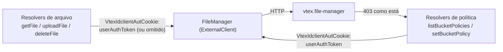

<!--
  Review interativo da spec `bucket-access-control-integration.md`.
  Gerado a partir da spec + do canvas HTML (specs/review-bucket-access-control-integration.html).
  Este arquivo é feito para ser lido dentro do GitHub (PR/arquivo) — usa <details> nativo,
  tabelas e mermaid, que o GitHub já renderiza sem precisar de HTML/JS custom.
  Se a spec mudar, regenere este arquivo — não edite o HTML à mão para refletir mudanças daqui.
-->

# 🧭 Bucket Access Control Integration — Review

**Draft** · `STR-773` · Fases 4, 9 · 3 User Stories · 4 Key Decisions · ✅ revisado 2026-08-07

> Encaminhamento correto de token de usuário e superfície GraphQL de política de bucket no
> `file-manager-graphql`. Este review resume a spec completa em
> [`bucket-access-control-integration.md`](./bucket-access-control-integration.md) — clique nas
> seções abaixo para expandir.

---

## 📋 TL;DR

| | |
|---|---|
| 🔓 **Problema** | O `file-manager-graphql` hoje encaminha `context.authToken` (token da própria app) em toda chamada ao file-manager — isso impede o file-manager de distinguir anônimo/autenticado/admin, e vai rejeitar em massa o tráfego via Admin Panel/store-form quando o enforcement for ativado. |
| 🔧 **Solução** | Trocar a origem do header `VtexIdclientAutCookie` para `context.userAuthToken` (omitido quando ausente) em um único ponto do `FileManager`, e adicionar 4 novas operações GraphQL como proxy fino de `/policies/*` do file-manager, sem lógica de permissão própria. |
| ⚠️ **Dependência bloqueante** | A US-1 (token forwarding) é pré-requisito explícito do gate de ativação da US-4 do `vtex.file-manager` — sem ela, todo tráfego proxied seria tratado como anônimo. |
| 📦 **Fora de escopo** | Mudanças dentro do próprio file-manager, `POST /policies/{bucket}/manifest` (exclusiva do builder-hub), UI do Admin Panel (Fase 10), e ativação da US-4 em produção (decidida pelo time do file-manager). |

### Fluxo de encaminhamento de token e proxy de política



---

## 📖 User Stories

<details>
<summary><b>US-1</b> — Encaminhar o token real do usuário em toda operação de arquivo <sub>como enforcement do file-manager · ⚠️ bloqueante</sub></summary>

- `VtexIdclientAutCookie` passa a carregar `context.userAuthToken`, não `context.authToken`, em `getFile`, `getFileUrl`, `uploadFile`, `deleteFile`.
- Quando não há token de usuário, o header é omitido — nunca enviado vazio.
- Isenção da allow list (`config/allowList.ts`) para `uploadFile` permanece inalterada.
- Mudança única no constructor de `FileManager`, compartilhada por toda operação de arquivo.

</details>

<details>
<summary><b>US-2</b> — Ler políticas de bucket via GraphQL <sub>como administrador de conta</sub></summary>

- `listBucketPolicies` faz proxy de `GET /policies`, paginando o `nextMarker` internamente até esgotar — o caller GraphQL recebe uma lista única e completa.
- `getBucketPolicy(bucket)` faz proxy de `GET /policies/{bucket}`.
- `403` sem o resource `file-manager-bucket-config` é exposto como está — sem checagem de permissão própria nesta app.

</details>

<details>
<summary><b>US-3</b> — Escrever e remover a política admin de um bucket via GraphQL <sub>como administrador de conta</sub></summary>

- `setBucketPolicy`/`deleteBucketPolicy` fazem proxy de `POST`/`DELETE /policies/{bucket}/admin`.
- Buckets protegidos (`vtex-assets-builder`, `vtex.catalog-images-products`, `vtex.file-manager-graphql-logo`) retornam o `403 "bucket policy is immutable"` do file-manager sem alteração.
- `POST /policies/{bucket}/manifest` nunca é exposta via GraphQL — exclusiva do builder-hub.

</details>

---

## 🏗️ Arquitetura

Duas mudanças aditivas ao `ExternalClient` `FileManager` já existente — nenhum client novo,
nenhuma camada de autorização própria adicional.

### Tabela de decisões de escopo

| Aspecto | Decisão |
|---|---|
| Header ausente | Omitido, nunca enviado vazio (Decision 1) |
| Onde vivem os métodos `/policies/*` | No `FileManager` existente, não um client novo (Decision 2) |
| Erros do downstream (incl. 403) | Relançados como estão — sem wrapper genérico (Decision 3) |
| Autorização extra (Sphinx) | Não adicionada — LicenseManager do file-manager já decide (Decision 4) |

---

## 🔑 Key Decisions

<details>
<summary><b>D1</b> · <code>Accepted</code> — Omitir o header em vez de enviar token vazio/undefined</summary>

**Decisão:** O constructor do `FileManager` só inclui `VtexIdclientAutCookie` quando `context.userAuthToken` é truthy; ausente, a chave do header é omitida, não enviada vazia.

**Consequência:** Alinha-se exatamente com a detecção de anônimo do file-manager — evita ambiguidade entre "header presente mas vazio" e "header ausente".

</details>

<details>
<summary><b>D2</b> · <code>Accepted</code> — Métodos <code>/policies/*</code> vivem no <code>FileManager</code> existente</summary>

**Decisão:** `listPolicies`, `getPolicy`, `setAdminPolicy`, `deleteAdminPolicy` são novos métodos públicos no `FileManager` já existente, reaproveitando constructor e header.

**Consequência:** Mantém uma única fonte de verdade de comunicação com o file-manager; herdam automaticamente o comportamento corrigido de token da D1.

</details>

<details>
<summary><b>D3</b> · <code>Accepted</code> — Erros do downstream (incl. 403) são relançados como estão</summary>

**Decisão:** `/policies/*` segue o padrão de `getFile`/`deleteFile` (relançar como está), não o de `saveFile` (`InternalServerError` genérico).

**Consequência:** Admin Panel recebe o motivo exato da rejeição (ex.: `"bucket policy is immutable"`), em vez de uma falha genérica.

</details>

<details>
<summary><b>D4</b> · <code>Accepted</code> — Sphinx <code>isAdmin</code> como filtro de população; License Manager continua o oracle de permissão</summary>

**Decisão:** `@requiresAuth` exige login. Sphinx `isAdmin` corta store vs Admin (igual `deleteFile`). A decisão de *qual* admin gerencia policy continua sendo o License Manager do file-manager — Admin sem o resource ainda vê o 403 original.

**Consequência:** Store não chega em `/policies/*`. Sphinx não substitui o resource; LM roles são Admin-only.

</details>

---

## ⚠️ Riscos

| Risco | Impacto | Probabilidade | Mitigação |
|---|---|---|---|
| US-1 é lançada antes da ativação da US-4 do file-manager | Nenhum | Alta (esperado) | Seguro deployar de forma independente — sem efeito comportamental até a ativação |
| Algum caller dependia implicitamente do token de app dar acesso elevado | Médio | Baixa | Coberto pelo risco de ativação do próprio file-manager; esta spec só corrige o tipo de token enviado |
| Resolvers `/policies/*` ficam fora de sincronia com o schema do file-manager | Baixo | Média | Pin de versão `vtex.file-manager: 0.x` já existente; mudanças passam por revisão própria |

---

## 🔌 Superfície GraphQL

4 novas operações, todas com `@requiresAuth`. Autorização de nível admin decidida inteiramente
pelo file-manager (LicenseManager) — sem lógica própria nesta app.

<details open>
<summary><code>QUERY</code> <b>listBucketPolicies</b></summary>

Proxy paginado de `GET /policies` — retorna todo bucket configurado na conta do caller, com `effectivePolicy`, `manifestPolicy` e `adminPolicy`.

`200` lista completa · `403` sem `file-manager-bucket-config`

</details>

<details>
<summary><code>QUERY</code> <b>getBucketPolicy(bucket)</b></summary>

Proxy de `GET /policies/{bucket}` — `null` para fontes não configuradas.

`200` · `403` sem permissão

</details>

<details>
<summary><code>MUTATION</code> <b>setBucketPolicy(bucket, readAccess, writeAccess)</b></summary>

Proxy de `POST /policies/{bucket}/admin`.

`200` política gravada · `403` bucket imutável · `403` sem permissão

</details>

<details>
<summary><code>MUTATION</code> <b>deleteBucketPolicy(bucket)</b></summary>

Proxy de `DELETE /policies/{bucket}/admin`.

`200` confirmação · `403` bucket imutável · `403` sem permissão

</details>

---

## ✅ Resultado do review

**17/18 itens conformes** com o template `specification` + `sdlc-golden-path`. Todas as 17
seções do template SDD (Problem Statement, Goals, User Stories com ACs, Key Scenarios,
Functional/Non-Functional Requirements, Out of Scope, Proposed Solution, Architecture Overview,
Alternatives Considered, Risks & Mitigations, Key Decisions, Implementation Plan, Data Models,
Interfaces, Integration Points, Invariants & Constraints) estão presentes e preenchidas. 1 gap
obrigatório do golden path permanece.

> ⚠ **Ação requerida · sdlc-golden-path · NFR gate — NFR Observability ausente**
>
> A feature adiciona 4 novas operações GraphQL e um novo padrão de encaminhamento de credencial —
> o `sdlc-golden-path` exige ao menos um NFR referenciando o O11y golden path, ou um waiver
> explícito com justificativa. A seção Non-Functional Requirements atual cobre apenas política de
> rede (sem novo `outbound-access`) e reuso de infraestrutura — sem menção a logging, tracing ou
> métricas de erro para as novas operações `/policies/*`.
>
> **Fix sugerido**, adicionar à seção NFR:
> ```
> NFR-O11y: Logging estruturado (sem PII) em toda operação /policies/*,
> incluindo bucket e resultado (200/403); nenhuma tracing span nova é
> necessária além da já emitida pelo ExternalClient subjacente.
> ```
> — ou, se realmente não se aplicar, `NFR-O11y: N/A — [justificativa]`.
